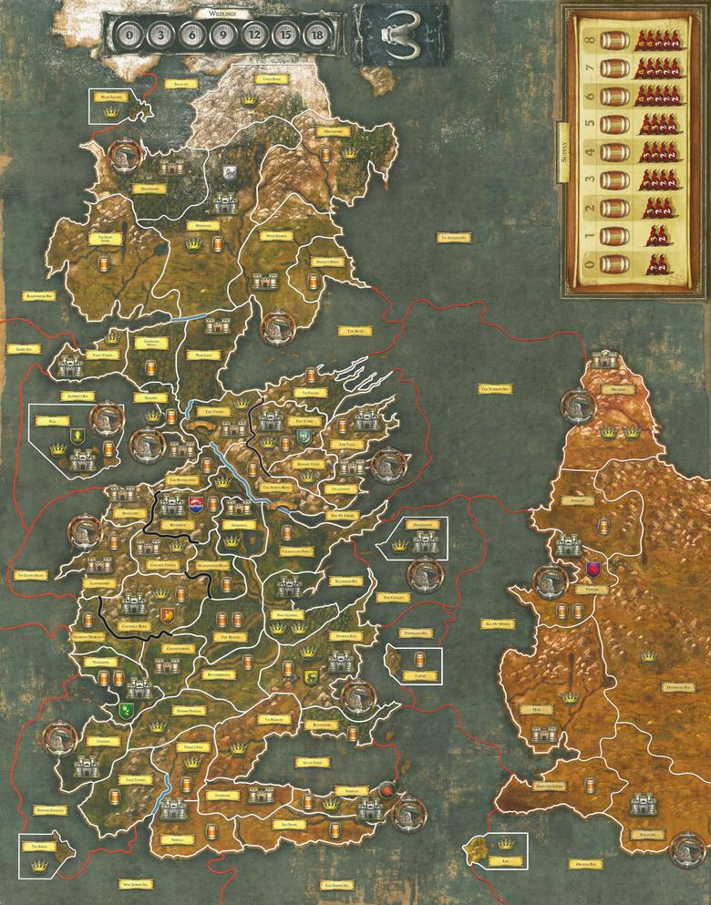
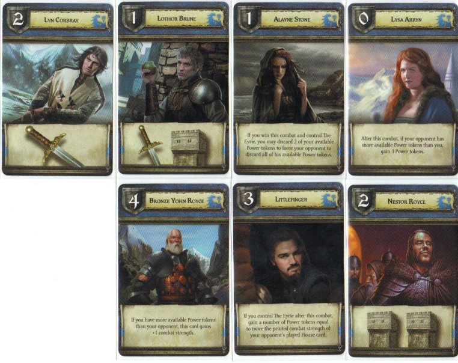
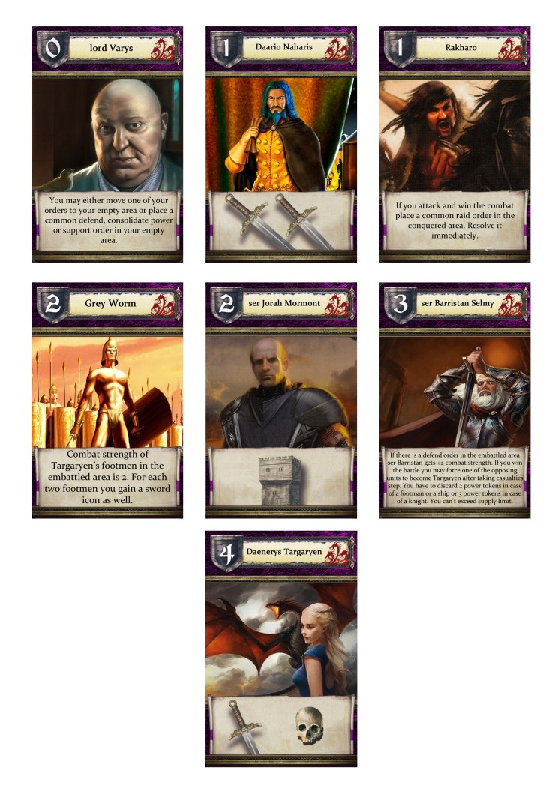
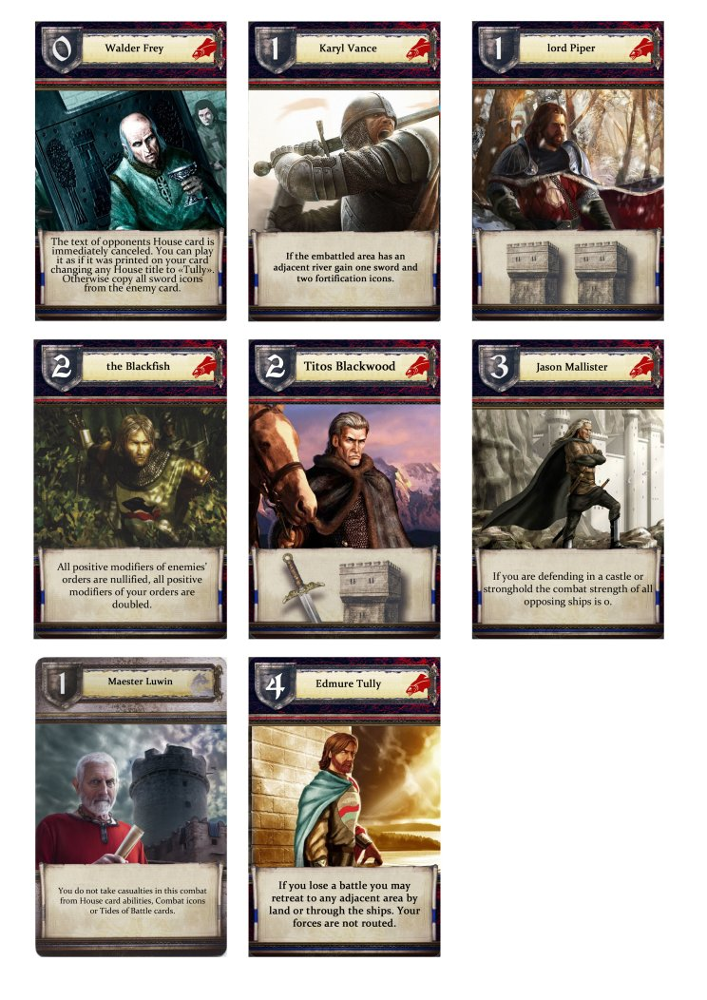
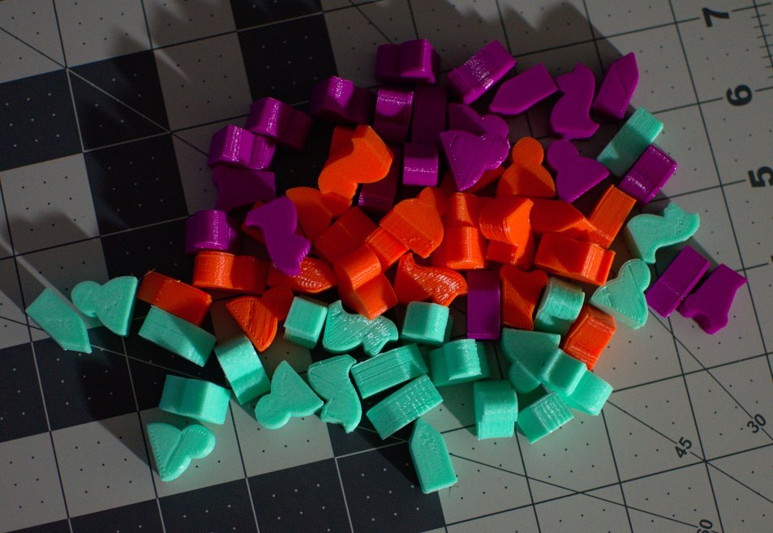

:title 9 Player Game of Thrones
:description Developing an expansion to one of my favorite board games
:slug 9-player-game-of-thrones
:date 2015-12-11

Last fall at my local board game meetup I was introduced to [A Game of Thrones The Board Game](https://www.fantasyflightgames.com/en/products/a-game-of-thrones-the-board-game-second-edition/).
Originally based on [Diplomacy](https://en.wikipedia.org/wiki/Diplomacy%5F%28game%29), _A Game of Thrones_ places three to six players in charge of the great houses of Westeros to vie for control of the continent.
With a minimal element of luck[^1] players spread influence with diplomacy, card selection, and strategic planning.
I am fascinated by this game and have played a few dozen times in person and one hundred games online[^2].

Now that we have dispensed with the pleasantries we can get on to the purpose of this post: expanding the game to support up to nine players.
There are a few variants available online - ["A Feast For Crows" Expansion](http://www.west2productions.com/Gamers/AGOT9/)[^3], ["The Winds of Winter" Expansion](http://enter-there.com/), and [Essos](http://boardgamegeek.com/filepage/103181/9-player-variant-essos-added)[^4].
I went for the "Essos" expansion since it was the first one I found.
I intend to try the other two when my regular playing group gets tired of the Essos version.
The rest of the post provides an overview of the changes and how I went about building it.
Look at the [original](http://boardgamegeek.com/filepage/103181) source for the files.

# The Map

In order to make room for three more players/houses the territories in the central portion of Westeros have been divided and rearranged and the western portion of Essos has been introduced.
There have also been some other balance adjustments (e.g. rearranging resources, borders, and strongholds) as fallout from introducing many new territories.
The wildlings track has changed to increments of 3 to account for the new players[^5].
The supply track has also been expanded up to 8 barrels since there are potentially more territories to cover on the path to seven castles.
Click on the map for a full resolution version.

## Essos
The most obvious change when looking at the new map is the addition of a new continent on the eastern portion of the map: Essos.
Hence the name of this expansion.
Essos consists of eight territories with two strongholds and two castles.
**Braavos** starts with a neutral force of 8 to eliminate a quick rush but is a valuable position late in the game for many houses.

The more interesting change accompanying the new continent is the additional sea zones.
Now there are four sea zones off the east coast of Westeros which allow for three houses to participate in combat.
In the official six player map it is common for sea zones to fall into a stalemate where players continually place support and raid tokens in alternating sea zones which completely eliminates sea zones from play[^6].
With three players the dynamic changes to incentivize diplomacy and/or strategy.

## The Riverlands
Move over Lannister time to make room for another house.
Divided into eight territories and covered with castles, strongholds, and resources - the Westerlands now serve as the home for two houses.
This change requires drastic changes to Lannister, Greyjoy, and Tyrell strategies while bringing more of the story to life by turning the Riverlands into a war-torn countryside.

## The Vale
The Vale has been littered with resources and is no longer the stomping grounds for House Stark.
There are now two strongholds and two castles east of the river along with a new sea zone, **The Bay of Crabs**.
The impassable borders and rivers along with no single central region make navigating and holding the Vale a significant challenge.
If you can muster enough strength there are plenty of resources and easy access to Essos.

## Impassable Borders
The official map contains _rivers_ denoted as blue borders between regions.
Rivers break the adjacency between otherwise neighboring spaces.
So units cannot move between, raid, or support spaces across a river.
Unless there is a bridge.
The Essos map introduces the concept of _impassable borders_ which are black lines between spaces.
These are functionally equivalent to rivers but lack the thematic motivation.
The impassable borders were introduced since the central region of the board is now crowded with two additional houses.

## Balance Adjustments
There are less drastic, but equally important, changes throughout the rest of Westeros in order to keep the game balanced.
Starting at the top and working our way down through each of the remaining houses, first we have House Stark.
Since the Vale is now occupied by a new house the resources that the Starks' traditionally rely on have been redistributed across a newly partitioned north.

**The Shivering Sea** now extends to **Braavos** and due to the newly added sea zone **The Byte** loses the ability act as _unraidable support_[^7].
That honor has moved to the west coast with the addition of "Bear Island" and the division of the **Bay of Ice** into two sea zones.
No longer touching either ocean, **Winterfell** is dramatically smaller.
Instead **Deepwood** is added to the west coast with a castle and a port.

Continuing down the western coast we reach House Greyjoy.
The castle at **Flint's Finger** and stronghold at **Seagard** have swapped places.
No other changes beyond the modifications for the Tullys and Lannisters.

Continuing the counterclockwise tour of Westeros, House Tyrell.
The castle previously **The Reach** is now further from **King's Landing** making it easier to hold, while the extra supply in from **Blackwater** is now further from **Highgarden** forcing House Tyrell to look elsewhere for supply.

Next up: the Martells.
**Storm's End** is no longer adjacent to the **Sea of Dorne** but the **Rainwood** has been added and includes a supply.
**Lys** is a nearby island and Essos is only one sea zone away.

Finally House Baratheon whose seat has been moved from **Dragonstone** to **Storm's End**.
This is to allow for separation between all three new neighbors.
**Tarth** is a new island added to the east of **Storm's End** and provides the opportunity for a quick supply grab.
The rest of the changes that affect House Baratheon have been discused previously.

## Printing the Map
By replacing the tracks with Essos the expanded map is nearly identical in size to the original.
Extra printouts can be placed anywhere around the table to track the influence and victory status for each house.
I went to the FedEx Office store across the street from my apartment to print the map.
Two hours and $50 later I walked out with a freshly minted map.

# The New Houses
The three new houses are House Arryn, House Targaryen, and House Tully.
Each house needs cards, power tokens, track markers, and a shield (to hide which orders have yet to be used).
The original designer produced a few pdfs containing all of the required images.
My wife and I spent two nights at the FedEx Office store printing, cutting, and laminating all of the pieces.
Lamination is not necessarily the best production method, but it was the cheapest that provided any level of durability.
I plan to try a different method next time.

## House Arryn
The House Arryn cards place a strong emphasis on power tokens.
In fact, every card with text deals with power tokens.
This provides an interesting twist to bidding since tokens are easier to come by but are also valuable in battle.

## House Targaryen
The House Targaryen cards either increase strength of units in combat or allow you to place/move orders after resolving combat.
Daenerys is the only card in the game (aside from the awful Tides of Battle cards) with a skull symbol.
The skull kills one unit even in the presence of towers.

## House Tully
Since the designers could not settle on seven cards House Tully is the only house to have eight.
Staying true to the theme, many of the cards provide tactical advantages if you are able to predict what card your opponent will play.

# The Units
I have recently obtained a Printrbot Simple Metal 3D printer for projects just like this one.
To create the pieces I found and printed these [pieces by Srokap](http://www.thingiverse.com/thing:279476) for each house at 30% infill to match the weight of the official pieces.
Purple for House Targaryen, sky blue for House Arryn, and orange for House Tully.
Purple and blue work thematically, but orange was the only other color of plastic I had on hand.

[^1]: The game has only one element of randomness - the ordering of events in the Westeros decks.

[^2]: An online version of the board game [Thronemaster](http://thronemaster.net)

[^3]: Not to be confused with the official "A Feast For Crows" expansion with House Arryn and scenarios.

[^4]: [Video overview](https://www.youtube.com/watch?v=D-tUFbSCCXE) from the designer

[^5]: The wildling track still follows the 1 power token per three players per space ratio. This leaves bidding strategies relatively untouched.

[^6]: The Raid/Support stalemate would be a great topic for a future blog post.

[^7]: Support placed in an area which cannot be raided since the player controls all neighboring zones.
