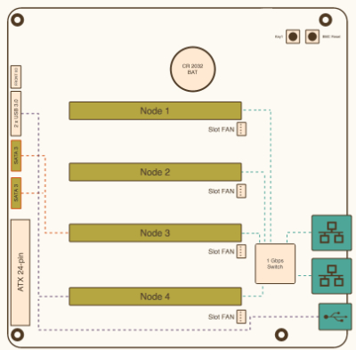

:title Building a compute cluster
:description Building my own compute cluster.
:date 2024-11-10
:slug building-a-compute-cluster
:category DevOps

So you want to run code on more than one computer. How do you do it? Follow this simple three step process.

1. obtain computers 
2. configure cluster work scheduler 
3. run jobs on computers through the work scheduler.

Okay. Maybe not that simple after all.
Let's back up and revisit some reasons why we would want to go beyond a single computer in the first place; scale and reliability.
And by "we would want" I mean "let me tell you about my experiences that led me to wanting to do this project".

My first experience with compute clusters was during my time in undergrad doing a research project to simulate the swimming motion of sea lampreys with fifty coupled oscillators.
Optimizing the coupling parameters by repeatedly solving the differential equations was too slow to complete in a single semester on my Pentium 4 laptop.
The math department had a beowulf cluster and I wrote a bash script to `ssh` and `scp` files to a handful of computers to distribute the work and collect the results.
`nohup` became my best friend that semester.
I didn't know it at the time, but this experience was the genesis for my lifelong obsession using computers to solve problems.

Wrapping up my physics degree and moving in to grad school I participated in a handful of physics projects[^1] that granted me access to the university wide compute clusters.
These clusters contained orders of magnitude more processors, had a centralized work scheduler, and used a shared filesystem.
This is where I learned the utility of `slurm` and having the right abstraction.
Enjoying this topic led me to switch my focus from physics simulation to distributed computing and started contributing to our department's custom distributed workflow system.[^2]

Fast forward a decade and I began an ongoing project to build a game playing agent for Pokémon.
One of my primary constraints for that project is to avoid encoding my knowledge of the game into the agents.
They need to learn it themselves.
Which then requires simulating thousands of hours of Game Boy playing.
Emulation is fast (headless reaching a 1,500 fps) and the screen resolution is tiny (160x144px), but the time adds up and it is much easier to experiment with multiple computers.
Conveniently, I have a handful of old computers laying around the house.
I spent a weekend adding ssh keys to each box and installing Julia.
I then reverted back to my "just scp and ssh things" lifestyle with the excuse of "it will be quick, don't waste the time setting up a real cluster".
Two months later and I'm still going.
Time to invest in running a cluster myself.

[^1]: Rapidfire summary: simulating hydrogenation of graphene sheets to introduce bandgaps by bending the sheet at the bond site, OpenCV to analyze video of frog leg muscles stretching (again for robotics like the sea lamprey), and searching for paths through the potential energy landscape for folding proteins.
[^2]: My [outdated publication from 2013](/files/automated-packaging-works13.pdf) building a packaging system for workflows soon to be functionally obscelete by the Docker monoculture.

<section>
<h2>Hardware</h2>

To keep things self contained and manage power consumption while I learn, I opted for the <a href="https://turingpi.com/product/turing-pi-2-5/">Turing Pi cluster board</a> as my hardware platform for experimenting with cluster schedulers.
As shown in the diagram to the right, the cluster board has four expansion slots for compute nodes all connected to an on-board ethernet switch.
There are many options for compute boards including Raspberry Pi, Nvidia Jetson, and Turing's own RK1.
I chose the RK1 since the price was competitive and there are no Raspberry Pi 5 compute modules yet.

  The cpu layout of the RK1's Rockchip RK3588 SoC is heterogeneous. 
  <code>lscpu</code> reports eight CPUs spread across three sockets. 
  The four Cortex-A55 cores are on one socket and the four Cortex-A76 cores come in two pairs of two.
  This will cause some challenges configuring slurm.

  The nodes are identical apart from their attached peripherals.
  Each node is powered from the same ATX power supply, connected to a dedicated m.2 ssd, has its own active cooler, and is configurable from the board management controller.
  Node 3 is unique since it is connected to two SATA 3 ports.
  This means that Node 3 will be our shared file server and control node.
  The others will be workers.

</section>

<section>
  <aside>
  <h1>Ansible</h1>

I opted to use <a href="https://www.ansible.com">Ansible</a> to automate configuring the cluster instead of running the commands manually. This is only my third time using Ansible so the code ended up being more bash scripts than ansible packages and some of the variables are hardcoded. You can find the playbook for the cluster on <a href="https://github.com/rampantmonkey/cluster">GitHub</a>. Feel free to file an issue to suggest improvements. I plan to use Ansible again for some upcoming projects.

</aside>
<h2>Operating System</h2>

Hardware obtained. On to the software starting with the operating system. Turing Pi provides <a href="https://docs.turingpi.com/docs/turing-rk1-flashing-os">documentation</a> and an Ubuntu image for the boards. Using the web interface provided by the board management controller I flashed the operating system image to each node sequentially. Surprisingly painless as long a I remembered not to refresh the page.

With the operating system installed I ran a handful of manual steps to prepare the nodes as targets for my ansible playbook.

<pre><code>$ sudo su
# useradd -rm ansible
# echo "ansible ALL=(ALL) NOPASSWD:ALL" > /etc/sudoers.d/ansible
# chmod 440 /etc/sudoers.d/ansible
# mkdir -m 700 /home/ansible/.ssh
# echo "ssh-ed25519 AAAAC3NzaC1lZDI1NTE5AAAAIO7kqBPUpVpPS4pTJXk5zQu2FMLZkNda2Q521btGCRDI" > /home/ansible/.ssh/authorized_keys
# chmod 600 /home/ansible/.ssh/authorized_keys
# chown -R ansible.ansible /home/ansible/.ssh
# exit
$ exit</code>
</pre>

Now we can use ansible to format and mount ssd for local scratch space. One bash script later and we are done.

<pre><code>#!/usr/bin/env bash

sudo lsblk -io NAME,TYPE,SIZE,MOUNTPOINT,FSTYPE,MODEL
sudo pvcreate /dev/nvme0n1
sudo vgcreate vgnfs /dev/nvme0n1
sudo vgs -v
sudo lvcreate -l 100%VG -n lvnfs vgnfs
sudo lvdisplay
sudo mkfs.ext4 /dev/vgnfs/lvnfs
sudo mkdir -p /mnt/bulk
sudo mount /dev/vgnfs/lvnfs /mnt/bulk
sudo df -H

sudo echo "/dev/mapper/vgnfs-lvnfs /mnt/bulk ext4 defaults 0 0" >> /etc/fstab</code>
</pre>

</section>

<section>
<h2>Slurm</h2>

Slurm is a cluster resource manager that allocates resources (CPU, Memory, GPU, ...) across multiple computers and manages contention between competing requests with a job queue.
There are four main components we need to set up in order to have a functional cluster. Shared storage, authentication, workers, and job controller.

<h3>Shared Storage</h3>

Why shared storage? This way all nodes have access to the same file system and submitting jobs is "scp to node 3 and submit the job". Otherwise, the user would have to manually copy files to every node when the job starts. Undermining the entire goal of this setup.

The simplest way to create a shared file system is to use NFS. We will be using node3 to share a file system from the attached sata drives. We are also going to completely ignore multi-user permissions since I am the only user. <code>fdisk</code>, <code>mkfs</code>, and <code>nfs-kernel-server</code> are all that is needed on node 3. Then on every other node we need to add the network volume to fstab with <code>echo "node3:/sharedfs /sharedfs nfs default 0 0" >> /etc/fstab</code>.

<h3>Authentication</h3>

Slurm uses <a href="https://github.com/dun/munge">MUNGE</a> to manage authentication between nodes in the cluster. Users of the cluster are already authenticated to the head node. Therefore, the cluster only needs a way to reliably encode this information and forward it to the workers. MUNGE uses a shared encryption key to securely transmit information between the nodes. The <a href="https://github.com/dun/munge/wiki/Man-7-munge#details">man page</a> for MUNGE provides more details on the rationale and methodology. All we need to do is install munge, generate the key, copy the key to each node (conveniently reusing the shared file system we previously set up), and starting the daemon. Make sure that the permissions on the munge key are correct. Otherwise, the <code>munged</code> service will not start.

<h3>Workers</h3>

<code>slurmd</code> is the worker process. This is the agent that connects to the controller and runs jobs on a single node. Install the <code>slurm-wlm</code> apt package, configure the process, and start the service. Relatively straightfoward with a few steps I initially got tripped up with.

<ol>
  <li>Every node, including the controller, should have the same configuration file.</li>
  <li>Slurm has support for cgroups to isolate jobs on the worker nodes. This needs to be <a href="https://github.com/rampantmonkey/cluster/blob/main/files/cgroup.conf">configured</a> and explicitly list the <a href="https://github.com/rampantmonkey/cluster/blob/main/files/cgroup_allowed_devices_file.conf">allowed devices</a>.</li>
  <li>The node description needs to match the discovered hardware on the box. <a href="">hwloc</a> extracts the processor information and slurm compares the output to the config list. In my particular case, the processor is asymmetric which violates one of slurm's assumptions (number of cores is an integer multiple of the number of sockets). In the case of Intel processors with P- and E- cores there is an <a href="https://github.com/SchedMD/slurm/blob/master/slurm/slurm.h#L2907">option</a> to enable or disable ecores. <a href="https://github.com/SchedMD/slurm/blob/3ef4566454f3c692a0d56c1a1f577ec7371fff8a/src/slurmd/common/xcpuinfo.c#L195-L217">No such option exists</a> for the Rockchip procesors. So we need to tell slurm that the config takes precedence with <code>SlurmdParameters=config_overrides</code>.</li>
</ol>

<h3>Job Controller</h3>

Now that we have the workers configured the controller, <code>slurmctld</code> is trivial. Make sure the head node has the <code>slurm-wlm</code> apt package installed, copy the same configs, start the service. Once it is running you can check if everything is connected with <code>sinfo</code>.

<pre><code>$ sinfo
PARTITION AVAIL  TIMELIMIT  NODES  STATE NODELIST
workers*     up   infinite      3   idle node[1-2,4]</code></pre>

And then run a simple job to test that everything is working. Run hostname on 3 nodes.

<pre><code>$ srun --nodes=3 hostname
node4
node2
node1</code></pre>
</section>

<section>
<h2>Running jobs on the cluster</h2>

In the previous section we used <code>srun</code> to run commands in real time on the cluster. Now we want to submit jobs with <code>sbatch</code> to the queue to be run when resources are available.

Repeat the hostname command above as a batch job

Julia hello world

Julia run a package

Julia @distributed

</section>

<section>
<h2>What Next?</h2>
<ol>
  <li>Run distributed Julia jobs on the cluster.</li>
  <li>Repeat this process on the other computers in my house to build a compute cluster with more processing power than my laptop.</li>
</ol>
</section>