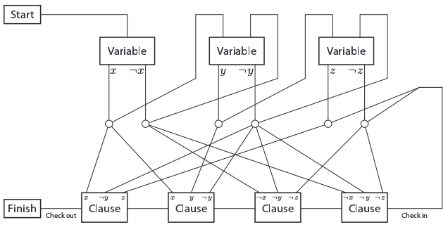

:title Classic Nintendo Games are NP-Hard
:description Exploration of computational complexity of some of my favorite childhood video games.
:date 2012-11-20
:slug classic-nintendo-games-are-np-hard

In computational complexity theory [NP-hard](http://en.wikipedia.org/wiki/NP-hard) is the category which contains decision problems that cannot be solved by a computer in finite time. Since it is impossible to solve without guessing (or breaking relativity), these type of problems form the foundation for excellent game mechanics. It turns out that many of the games I grew up playing fall into the NP-hard category. In March 2012, Greg Aloupis, Erik D. Demaine, and Alan Guo [published proofs for five of these games](http://arxiv.org/abs/1203.1895): [Mario](http://en.wikipedia.org/wiki/Super_Mario_(series\)), [Donkey Kong](http://en.wikipedia.org/wiki/Donkey_Kong), [Legend of Zelda](http://en.wikipedia.org/wiki/The_Legend_of_Zelda_(video_game)), [Metroid](http://en.wikipedia.org/wiki/Metroid_(video_game\)), and [Pok&eacute;mon](http://en.wikipedia.org/wiki/Pokémon_(video_game_series\)).

Proving that a problem is NP-hard boils down to showing that it is isomorphic to another, already proven, NP-hard problem. The first problem to be proven NP-hard was [satisfiability](http://en.wikipedia.org/wiki/Boolean_satisfiability_problem), so most proofs involve developing a mechanisim (or series of mechanisms) which form the isomporphism from the current problem into satisfiability. This is the method used in <emph>Classic Nintendo Games</emph>.

All of these games consist of exploring a map or level defined by various types of objects with which the player may interact. Most of the games also include items and battles, but these systems are not discussed in the paper.

To prove the NP-hardness of classic Nintendo games, the authors developed a framework which uses five gadgets to map level exploration into 3-SAT. After they prove that the framework is valid they proceed to show each of the five gadgets for each of the games. If you are interested in the details for each game check out the paper (no subscription required!). Let's take a look at the framework used.

- <emph>Start</emph> trivial, but necessary to define the beginning of the map.
- <emph>End</emph> usually trivial, but can be more complicated if the player is required to be in a certain state.
- <emph>Variable</emph> requires player to choose one of two paths, thereby closing the other.
- <emph>Clause and Check</emph> only allow passage if all variables leading to this gadget are set correctly
- <emph>Crossover</emph> allow traversal between two crossing paths without leakage into the other

The clause &amp; check and variable gadgets directly correspond to the variables and statments from 3-SAT. The start, end, and crossover gadgets serve as the bridge between platform games and satisfiability. Now all that is left is to show that each of the gadgets exist for a given game.

This paper is an excellent example of computational complexity proofs. It clearly walks through the required steps and provides a general framework for showing other games are also NP-hard. The tie-in to Nintendo games is brilliant and provides an excellent starting point for reading the paper.

One negative of the paper is the repetitiveness. To improve the quality of the paper, I would have appreciated an exploration of a different part of the game (e.g. the battle system in Pok&eacute;mon).
