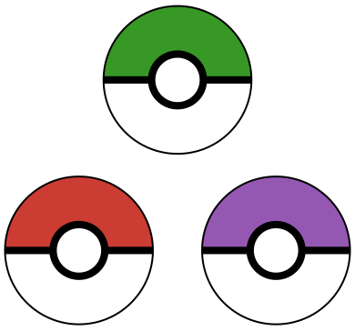
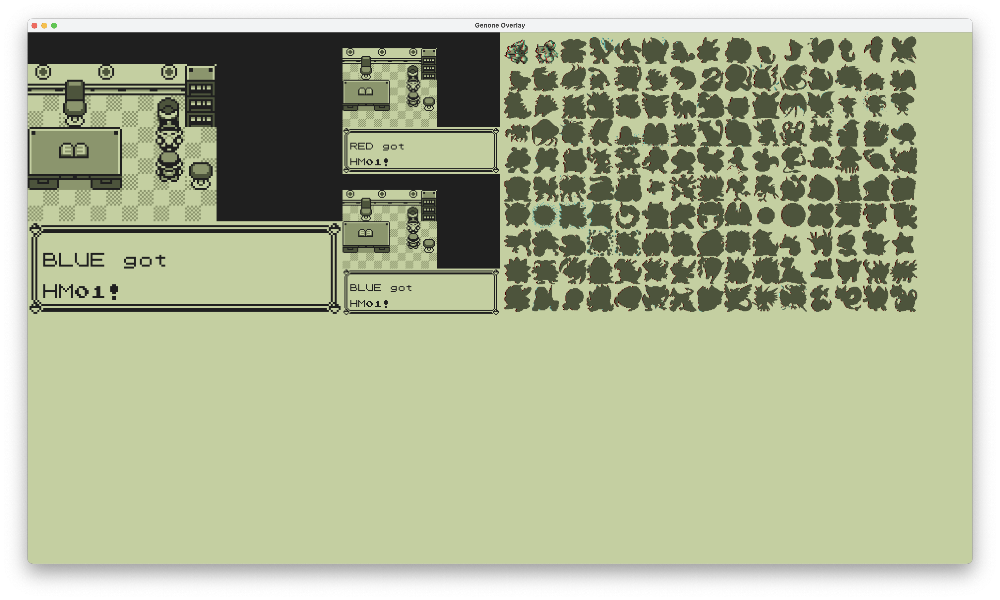
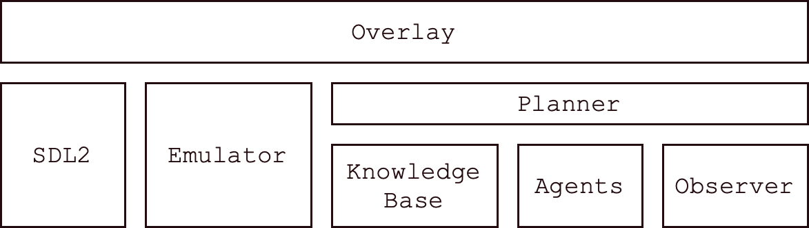
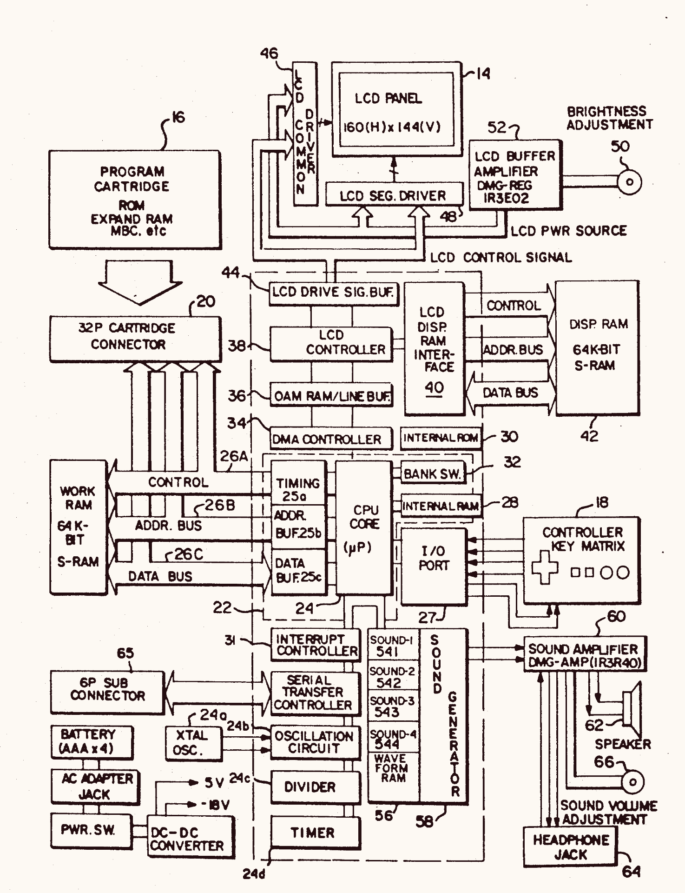
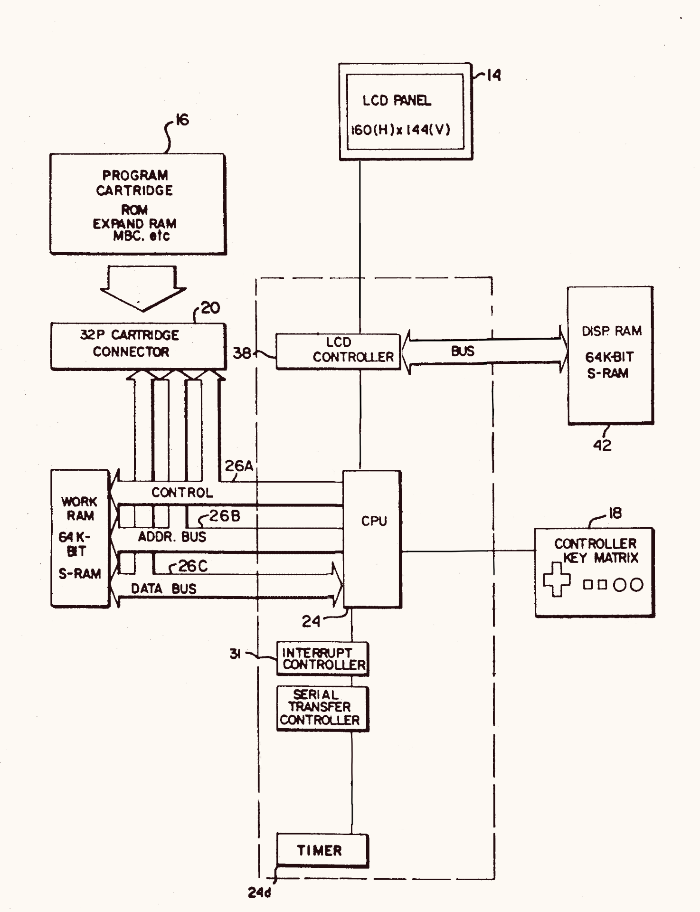
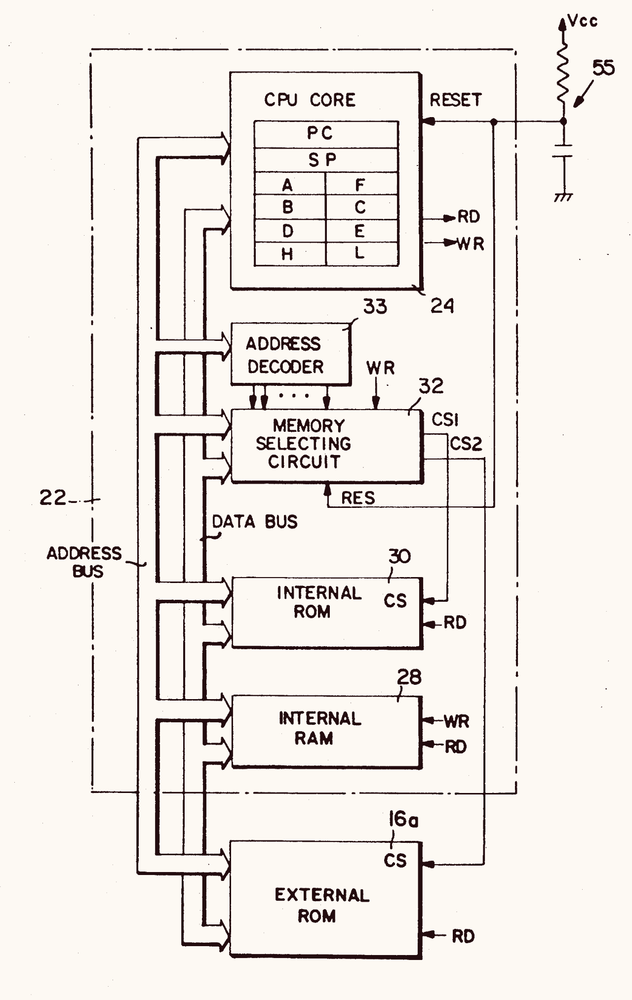

:title Genone
:description A quest to catch 'em all automatically with Julia.
:date 2025-02-08
:category Pokémon

<section id="#intro">
    
    
As a child of the 90s I played my fair share of Pokémon on my Game Boy Pocket. I completed the Pokedex in both Blue and Yellow versions. Convincing my brother to trade Red exclusives was the most challenging task. Fast forward a few decades to me finding my cartridges and console in a box during a move. Turning them on I was greeted with the "New Game" screen.

    
...

    
The cartridge batteries were depleted and my saves were lost. I replaced the batteries and started playing again. Which sparked a better(?) idea. <emph>What if I build a program to Catch 'em all for me?</emph>

    
Since then, I have been working on Genone as my side project to dive deeper in to reinforcement learning and Julia.

    
This post is to document my progress and share what I have learned.

    
Starting from the ROMs of the games, Genone can play the game through obtaining HM01 on the S.S. Anne.

    
</section>

<section id="project-structure">
    <h1>Project Structure</h1>
    
Genone consists of six components and the interface is built on top of SDL2.

    <ol>
        <li><a href="#overlay_">Overlay</a>. The display depicted in the screenshot above.</li>
        <li>
            <a href="#emulator">Emulator</a>. A Game Boy emulator.
            <ol>
                <li><a href="#cpu">CPU</a></li>
                <li><a href="#mmu">Memory Mapping Unit (MMU)</a></li>
                <li><a href="#cartridge">Cartridge</a></li>
                <li><a href="#clock">Clock</a></li>
                <li><a href="#lcd">LCD</a></li>
                <li><a href="#link-cable">Link Cable</a></li>
            </ol>
        </li>
        <li><a href="#knowledge-base">Knowledge Base</a>. A database of facts about the game.</li>
        <li><a href="#observer">Observer</a>. What is happening in the game right now?</li>
        <li><a href="#planner">Planner</a>. What actions need to be taken in order to advance the quest?</li>
        <li><a href="#agents">Agents</a>. What buttons to press in order to accomplish the desired goal?</li>
    </ol>
    
</section>

<section id="overlay_">
    <h1>Overlay</h1>
    <aside id="project-status">
        <h1>Project Status</h1>
        

            This project is currently paused to focus on work and family life. The source code is not publically available as I do not want to rattle the cage of Nintendo's lawyers. <a href="/contact">email me</a> if you want to learn more or collaborate on the next iteration of this project.
        

    </aside>
    
The primary interface for Genone is the overlay. This is a julia program built on top of SDL2 that runs all of the other libraries (multiple emulators, planner, knowledge base, etc) and displays the current state. The overlay shows three emulators
    
The overlay also allows user interaction. Which was invaluable while developing the project. I lost count of the number of times where "just manually move the character one space to the left" or "quit the unexpected dialog box" unblocked progress. For example, <code>WASD</code> moves the character, <code>J</code>/<code>K</code> presses A or B in the emulator, <code>Q</code>/<code>E</code> cycle between the emulators and <code>O</code> prints out the observation state. 

    
The final trick of the overlay is managing a library of snapshots. The overlay can take a snapshot of any emulator and agent, save it to disk, and reload it later. This way I can run the agent, save the state once a certain event happens (trainer defeated), tweak the logic, restart and observe how the change impacted the behavior. Without this ability I would have to restart the run from a new rom every single time something changed, destroying the feedback loop.
 
    
Building a customized interface for this project reduced friction and visualized abstract concepts. Using SDL2 from Julia was surprisingly painless. Drawing an interface at the refresh rate of my display was also a transformative experience compared with my other data and web projects.

</section>

<section id="emulator">
    <h1>Emulator</h1>
    
Our goal is to catch all 150 Pokemon in the first generation of pokemon games.
    These games were originally released on the Nintendo Game Boy.
    While we could build a robot to play on the actual hardware (either mechanically with servos pressing the buttons or electrically with relays connecting the desired buttons to ground) that will be limited to the speed of the Game Boy's processor (4 MHz) and the number of Game Boys that I own (about 10).
    Instead we can build a software version of the console called an emulator.
    

When you think of playing a Game Boy (or any other console for that matter) the input and output are the primary focus.
Press buttons to tell the game what you want to happen.
Watch the screen to see what did happen.

On the gameboy there are 8 buttons and a 160x144 4-bit 60Hz display. 
There are also many components in between.
The rest of this chapter will focus on those components.

When buliding an emulator there are a few choices to make up front.
Accuracy or performance. (We want accurate enough that Pokemon is playable. But the put the rest of our stat points in to performance.)
Layer of abstraction.
We can choose to emulate the hardware (reverse engineer the PCB schematic, read through the documentation on each chip, and measure the signals between chips.)
or we can choose to emulate the programming interface (it is a machine designed to play any game you create. Nintendo published a programming guide. This describes the interface compilers and programmers wrote against for their games).
We will take the latter path.

This emulator will start with a copy of the game cartridge dumped from the official hardware. 

Figure 4 of Patent US-5134391-A is a block diagram of the Game Boy console.
This figure (reproduced below) shows all of the key components in the system.

Since I am emulating the system and only playing a single game I can simplify the block diagram by removing hardware specific things; amplifiers, power, buffers, ports, ...
Sound is also removed since it is not required for automated gameplay (and the cacophony is unbearable when playing at 100x speed).
All that remains are the components that I need to build and their connections.

<section id="cpu">
    <h3>CPU</h3>
    
Let's start with the CPU.
    Once the console is turned on the CPU executs a single loop until power is turned off (or one of the magic "stop" instructions is encountered).
    The CPU has a collection of 16 bit registers.
    Everything the processor does happens within these registers.
    

    
The PC register is the program counter.
    This register stores the memory address of the next instruction to execute.
    The SP register is the stack pointer.
    This register stores the memory address of the stack.
    

    
The remaining registers - AF, BC, DE, HL - are general purpose registers that can be used as the programmer sees fit.
    These registers can also be split in to two half-width (or 8-bit) registers. 
    A, F, B, C, D, E, H, L.

    
The instruction set gives some bias towards the "intended" purpose of some registers.
    The A register is an accumulator.
    Many math instructions store their output in this register. Great for "add everything in this list". Think of it as the result of a reduce function.
    

    
The F register stores flags indicating certain states of computation; Zero, Negative, Half Carry, and Carry.

    
There are instructions which use the HL register as a memory address.
    "Load the value from memory address (HL) in to register B".

    
Let's walk through an example or two about the instruction set.

    
The CPU starts by fetching the byte stored at the address contained in PC.
    This byte is called the operation code (or just opcode).
    

    
The opcode is then used to decode which instruction to execute in a <a href="https://www.pastraiser.com/cpu/gameboy/gameboy_opcodes.html">lookup table</a>. Once the opcode is decoded, the specificed instruction is executed.

    
For example, 0x7e is the Load instruction.
    This instruction takes the value stored in the (HL) address, fetches it from main memory, and saves it to the A register.

    
Or 0x82 is the Add A, D instruction.
    This instruction takes the values stored in A and D, adds them together, and saves the result in the A register.

    
After executing the instruction, the program counter is incremented to the next location.

    
Then the loop repeats, fetching the instruction stored at the new program counter address.

    
Some of the more challenging instructions to implement correctly (especially if you care about the correct timings) are Jump, Decimal Coded Binary, and Interrupt Enable.
    

</section>

<section id="mmu">
<h3>Memory Mapping Unit (MMU)</h3>

Every component in the gameboy is accessible through a hard-wired set of memory addresses.
This is the primary mechanism for communication between the cpu and the peripherals.
i.e. buttons, cartridge, sound, link port, ...

A second figure from the patent shows the memory architecture.

This means that a memory instruction read or write instruction could be routed to any number of places and the programmer must keep this list in mind when writing their program.

Like the instruction table, this ended up being encoded as a giant switch statement with some multiple dispatching mixed in. While performant, I could not find any more elegant way to encode these constraints. (A general theme of this entire project - Julia lacking the features to encode what I want.)

<pre>
<code>function Component.readb(mmu::Mmu, addr::UInt16)::UInt8
    if 0x0000 <= addr < 0x0100 && mmu.bootRomEnabled
        readb(bootrom, addr)
    elseif 0x0000 <= addr < 0x8000
        readb(mmu.cart, addr)
    elseif 0x8000 <= addr < 0xa000
        readb(mmu.ppu, addr - 0x8000)
    elseif 0xa000 <= addr < 0xc000
        readb(mmu.cart, addr)
    elseif 0xc000 <= addr < 0xe000
        readb(mmu.workram, addr - 0xc000)
    elseif 0xe000 <= addr < 0xfe00
        readb(mmu.workram, addr - 0xe000)
    elseif 0xfe00 <= addr < 0xfea0
        readb(mmu.oam, addr - 0xfe00)
    elseif 0xfea0 <= addr < 0xff00
        0x00
    elseif 0xff00 <= addr < 0xff80
        readb(mmu.io, addr - 0xff00) | (addr == 0xff00 ? 0xc0 : 0x00)
    elseif 0xff80 <= addr < 0xffff
        readb(mmu.highram, addr - 0xff80)
    elseif 0xffff == addr
        mmu.interrupt_enable
    else
        0x00
    end
end</code></pre>
</section>

<section id="cartridge">
<h3>Cartridge</h3>

Games for the Game Boy are shipped as plastic cartridges with a custom pcb.
This pcb has read only memory chips which save the game code and rom chips for saving your progress through the game.
There are many kinds of cartridges available based on the amount of game code needed (each kilobyte cost more to manufacture so you wanted to get the exact right size) and other features like real time clock or rumble.
This is most commonly described by the Memory Bank Controller type.
The memory bank controller is an integrated circuit on the cartridge pcb which routes requests from the game boy to the correct memory chip.

The cartridge connects to the gameboy through 32 exposed pins on the cartridge. These pins are then routed wherever necessary within the cartridge through the MBC controller. There are many variations on the controller as games got more complicated and added other features. Below is a listing of the pinout for the interface.

<ol>
    <li>+3.3V</li>
    <li>Clock</li>
    <li>Write</li>
    <li>Read</li>
    <li>Chip Select</li>
    <li>Data/Address Bit 0</li>
    <li>Data/Address Bit 1</li>
    <li>Data/Address Bit 2</li>
    <li>Data/Address Bit 3</li>
    <li>Data/Address Bit 4</li>
    <li>Data/Address Bit 5</li>
    <li>Data/Address Bit 6</li>
    <li>Data/Address Bit 7</li>
    <li>Data/Address Bit 8</li>
    <li>Data/Address Bit 9</li>
    <li>Data/Address/Bit 10</li>
    <li>Data/Address/Bit 11</li>
    <li>Data/Address/Bit 12</li>
    <li>Data/Address/Bit 13</li>
    <li>Data/Address/Bit 14</li>
    <li>Data/Address/Bit 15</li>
    <li>Address Bit 16</li>
    <li>Address Bit 17</li>
    <li>Address Bit 18</li>
    <li>Address Bit 19</li>
    <li>Address Bit 20</li>
    <li>Address Bit 21</li>
    <li>Address Bit 22</li>
    <li>Address Bit 23</li>
    <li>Chip Select 2</li>
    <li>IRQ</li>
    <li>Ground</li>
</ol>
</section>

<section id="clock">
<h3>Clock</h3>

Clock.
The quartz clock drives the cpu at 4MHz.
Each clock cycle the CPU does one "operation". Some "Instructions" from the ISA take multiple cycles because they are composed of more primitive/single cycle operations (like fetching from memory).

There is also a divider that takes the clock signal and divides it into smaller steps. These divided steps are used to drive interrupts, manage the lcd controller, and coordinate direct memory access. These signals are stored in a handful of memory mapped registers.

</section>

<section id="lcd">
<h3>LCD</h3>

The display is 160x144 4-bit grayscale 60Hz LCD panel. The small data rate was fantastic for battery life and is trivial to brute force many computer vision algorithms against with today's processors.

</section>

<section id="link-cable">
<h3>Serial Connection / Link Cable</h3>

The Game Boy has a port to allow connections between two consoles (well, actually many consoles if you get the 4-way adapter...).
This communication is done over a serial connection on a cable called the "Link Cable".
Each console has a port.
Connect the ports with a link cable.
There are 4 wires, ground, vcc+, data, clock.
Data is transfered one byte at a time per clock cycle.
One of the consoles is the leader, responsible for driving the clock.
The other is the follower, which takes the clock signal from the leader.

Data is bidirectional.

This is the underlying transport mechanism for trading pokemon.

Within the emulators we can just copy the bytes from one emulator's memory to the other. Particularly simple since in this use case we are running the emulators within the same process and incrementing their clocks simultaneously. Building a networked one would require more effort and coordination on top of a TCP connection.

</section>

<section id="knowledge-base">
    <h1>Knowledge Base</h1>
    
To begin reasoning about the game I built a knowledge base of facts. This includes things like the list of pokemon, the list of items, maps of the game world, and locations of each trainer.

    
There were three primary data sources for this knowledge base: fan sites/my memory, <a href="https://github.com/pret/pokered">game disassembly</a>, and playing the game itself. My initial goal was to rely solely on playing the game itself. However this is the least efficient and least accurate way to obtain data. And since this wis a side-project to play a 30 year old game, I opted to take shortcuts once I built a basic game playing agent that could obtain the desired dataset given enough time and compute budget.

    
The fan sites/my memory are not particularly interesting. Just the typical web scraping and text file munging to create giant enums.

    
The game disassembly provides more interesting things like "the state machine of events" to progress through the game and the exact probabilities of encounters in a given location. This was a lot of "reuse the gameboy emulator core to translate the logic" and "watch memory go by as I manually played the game".

    
The best example of "obtain data by playing the game" is Cartographer. My agent that wanders around the map, recording a navigation mesh. For this I ended up taking advantage of Julia's distributed library to run on all of the computers in my house. While being a brute force approach I was able to create a map of all the walkable areas in the game. This took 3 months and inspired me to look at the other data source in more depth to move the project along.

    
As part of the knowledge base I also built a simulator that exposes the event graph, evolution lines, and catching mechanics. This is the primary way I trained the <a href="#planner">planner</a> to generate runs that catch every Pokémon. Finally, some actual reinforcement learning in action. Albeit a heavily model-driven approach.

</section>

<section id="planner">
    <h1>Planner</h1>
    
Not much to say here. It is just a gradient following optimizer to traverse the event graph and use the simulator to pick the agents. I estimated the cost of running each agent (by timing them and averaging the results). The total cost (i.e. time) was the value to optimize. I want to revisit this with a cartesian genetic programming approach.

</section>

<section id="observer">
    <h1>Observer</h1>
    
The observer is responsible for watching the emulator's memory, screen, and button presses to keep track of what is happening in the game. It produces a large data structure representing the entire state of the game at any particular point in time. This is the primary input to the <a href="#agents">agents</a> in order to determine what button to press next or if they have reached their goal.

    <pre>
<code>struct GameState
    pokedex::Pokedex
    playername::Union{String, Nothing}
    rivalname::Union{String, Nothing}
    position::Tuple{UInt8, UInt8, UInt8}
    text::Matrix{Char}
    objects::Matrix{Union{ObjectOfInterest, Nothing}}
    menu::Union{Vector{Tuple{String, Bool}}, Nothing}
    battle::Battle
    has_oaks_parcel::Bool # Expand to support other events
    has_pokedex::Bool
    pokedollars::Int
    playerfacing::Direction
    bag::Vector{Tuple{Item, UInt8}}
    events::Set{Event}
end
</code></pre>

Most of the work in Observer is translating bits of memory into Julia structs. Reading the text on the screen is different. Here I actually look at the pixels to figure out what is presented on screen.

Pixels + Font Atlas -> 20x16 grid of characters -> Words -> Union{Nothing, Menu, Paragraphs}

The screen is 160x144 pixels.
All of the font glyphs are rendered on a 20x16? grid.
The font has 90 8x8 glyphs.
Which means there are 20x16xnx90x8 comparisons to make per frame.

The font exists. Just need to parse it into a grid of pixels per character. Or just do it by hand with an image editor. There are very few characters. Yay! Another giant switch statement...

<pre>
<code>const font = Dict{Char, Matrix{UInt8}}(
                                       'A' => [1 1 1 0 1 1 1 1;
                                               1 1 0 1 0 1 1 1;
                                               1 1 0 1 0 1 1 1;
                                               1 0 1 1 1 0 1 1;
                                               1 0 0 0 0 0 1 1;
                                               0 1 1 1 1 1 0 1;
                                               0 1 1 1 1 1 0 1;
                                               1 1 1 1 1 1 1 1
                                              ],
                                       'B' => [0 0 0 0 0 1 1 1;
                                               0 1 1 1 1 0 1 1;
                                               0 1 1 1 1 0 1 1;
                                               0 0 0 0 0 0 1 1;
                                               0 1 1 1 1 1 0 1;
                                               0 1 1 1 1 1 0 1;
                                               0 0 0 0 0 0 1 1;
                                               1 1 1 1 1 1 1 1;
                                              ],
                                       'C' => [1 1 0 0 0 0 1 1;
                                               1 0 1 1 1 1 0 1;
                                               0 1 1 1 1 1 1 1;
                                               0 1 1 1 1 1 1 1;
                                               0 1 1 1 1 1 1 1;
                                               1 0 1 1 1 1 0 1;
                                               1 1 0 0 0 0 1 1;
                                               1 1 1 1 1 1 1 1;
                                              ],
                                       'D' => [0 0 0 0 0 1 1 1;
                                               0 1 1 1 1 0 1 1;
                                               0 1 1 1 1 1 0 1;
                                               0 1 1 1 1 1 0 1;
                                               0 1 1 1 1 1 0 1;
                                               0 1 1 1 1 0 1 1;
                                               0 0 0 0 0 1 1 1;
                                               1 1 1 1 1 1 1 1
                                              ],
                                       # Keep going for all of the characters...
                                       )
</code></pre>

The small image size, limited character set, and fixed grid positions make a bruteforce cpu-driven approach faster than shuffling everything off to the gpu or building a convolutional-neural-network.

Bonus points because we can use simd to parallize the pixel comparisons.

The brute force approach also removes any probability and uncertainty. Completely deterministic process with no training required.

Why not a convolutional neural network?
How do I build a system to extract the text from the pixels on screen?
chfoo/tppocr solved a similar problem using tesseract to enhance the Twitch Plays Pokemon live stream.
Starting with the game's font atlas to define the desired characters, tppocr asks tesseract to look for any characters in a region of the screen.
Specifically, the bottom region of the screen where dialog appears.
I used their tesseract font input and OCReract.jl to read frames form the emulator screen.
I was able to extract most of the characters in a dialog box.
Enough that with a small dictonary and string matching I could produce the correct dialog.
This approach fell apart when trying to read the menu system. Overlapping windows and looking for text on the entire screen dropped the accuracy below the point of feasibility.
I am sure that this approach could work with more refinement.

What about menus and dialog boxes? How can we recognize these higher level concepts?
Conveniently, the current menu selection is marked with one of the glyphs.
If you see the triangle -> it is a menu. Otherwise -> Dialog.

There are two types of menus in Red and Blue.
Linear menus like Continue/New Game/Options or the start menu.
Grid menus like Battle/PkMn/Items/Run.
These are easy to recognize by looking for multiple spaces in between words on a single row of text.
Once we have the menu extracted we can then use dead reckoning to move to the menu option we wish to select.

</section>

<section id="agents">
    <h1>Agents</h1>
    
The agents' job is to reach a high level goal by pressing buttons. The planner composes a bunch of agents together to complete the Pokédex. This ends up forming a pseudo programming language where the planner is generateing programs and the agents are the instruction set. This was one of the most abstract, exciting, and mind-bending parts of the project. I want to revisit this with a better programming language in the future.

    
The agents, surprise, are based on an informal interface and mutliple dispatch. Each agent has a constructor, a <code>suggest(a::Agent, game::GameState)::Button</code> to decide the next button to press, a <code>complete(a::Agent, game::GameState)::Bool</code> to decide if it has accomplished its goal, and a <code>reset!(a::Agent)::Nothing</code> to reset the state if a wrapping agent decides to restart for some reason.

    
The planner ends up producing something like this (the code used to create the initial screenshot in this post).

<pre>
<code>mutable struct CompleteARun <: GoalSeekingAgent
    run::Simulator.Run
    sub::Agent

    function CompleteARun(r::Simulator.Run; stepcb::Function=()->(), battlecb::Function=()->())
        new(r, Sequentially(BeTheVeryBest(;starter=Planner.whichstarter(r)), # Get through the intro sequence
                            AdHocGoal(MenuAdvancer(),
                                      (_, g) -> g.has_pokedex),
                            AdHocGoal(Constant(ButtonDown),
                                      (_, g) -> g.position[2] != 5 && g.position[2] != 0),
                            DefeatTrainer(Position(:ViridianForest, 2, 19), BeatViridianForestTrainer2,
                            DefeatTrainer(Position(:PewterGym, 4, 6), BeatPewterGymTrainer0),
                            DefeatTrainer(Position(:PewterGym, 4, 2), BeatBrock,
                            DefeatTrainer(Position(:Route3, 11, 7), BeatRoute3Trainer0),
                            DefeatTrainer(Position(:Route3, 15, 6), BeatRoute3Trainer1),
                            DefeatTrainer(Position(:Route3, 20, 7), BeatRoute3Trainer3),
                            DefeatTrainer(Position(:Route3, 28, 7), BeatRoute3Trainer6),
                            DefeatTrainer(Position(:Route3, 34, 9), BeatRoute3Trainer7),
                            DefeatTrainer(Position(:MtMoon1F, 30, 7), BeatMtMoon1Trainer2),
                            DefeatTrainer(Position(:MtMoonB2F, 12, 19), BeatMtMoon3Trainer0),
                            DefeatTrainer(Position(:MtMoonB2F, 12, 9), BeatMtMoonExitSuperNerd),
                            PickFossil(Planner.whichfossil(r)),
                            DefeatTrainer(Position(:CeruleanCity, 22, 7), BeatCeruleanRival),
                            DefeatTrainer(Position(:Route24, 11, 32), BeatRoute24Trainer5),
                            DefeatTrainer(Position(:Route24, 12, 29), BeatRoute24Trainer4),
                            DefeatTrainer(Position(:Route24, 11, 26), BeatRoute24Trainer3),
                            DefeatTrainer(Position(:Route24, 12, 23), BeatRoute24Trainer2),
                            DefeatTrainer(Position(:Route24, 11, 20), BeatRoute24Trainer1),
                            DefeatTrainer(Position(:Route24, 11, 16), BeatRoute24Rocket),
                            DefeatTrainer(Position(:Route25, 10, 5), BeatRoute25Trainer6),
                            DefeatTrainer(Position(:Route25, 15, 5), BeatRoute25Trainer0),
                            DefeatTrainer(Position(:Route25, 19, 5), BeatRoute25Trainer1),
                            DefeatTrainer(Position(:Route25, 21, 9), BeatRoute25Trainer3),
                            DefeatTrainer(Position(:Route25, 24, 9), BeatRoute25Trainer7),
                            DefeatTrainer(Position(:Route25, 38, 8), BeatRoute25Trainer5),
                            BillsHouse(),
                            DefeatTrainer(Position(:CeruleanGym, 6, 8), BeatCeruleanGymTrainer1),
                            DefeatTrainer(Position(:CeruleanGym, 6, 4), BeatCeruleanGymTrainer0),
                            DefeatTrainer(Position(:CeruleanGym, 6, 3), BeatMisty),
                            DefeatTrainer(Position(:CeruleanCity, 31, 10), BeatCeruleanRocketThief),
                            DefeatTrainer(Position(:Route6, 18, 27), BeatRoute6Trainer5),
                            DefeatTrainer(Position(:Route6, 9, 31), BeatRoute6Trainer4),
                            DefeatTrainer(Position(:Route6, 9, 32), BeatRoute6Trainer3),
                            DefeatTrainer(Position(:SsAnneCaptainsRoom, 5, 4), GotHm01), # Also beats the rival despite a missing event flag.
                            Spin(),
                            ; cb=stepcb))
    end
end
</code>
</pre>
</section>

<section>
    <h1>Conclusion</h1>
    
I had a blast working on this project. I learned a ton. Got to merge together a diverse set of topics (Julia, distributed computing, machine learning, graph algorithms, compilers, Pokémon, emulation, logic programming, ...). I feel like I understand Julia well and would definitely use it for optimization and math problems again. Though I doubt I'll be using it for any general purpose programming. I am ready for the next project. Maybe I'll revisit the planner/knowledge base/agents compilers problem in the future.

</section>
</section>
