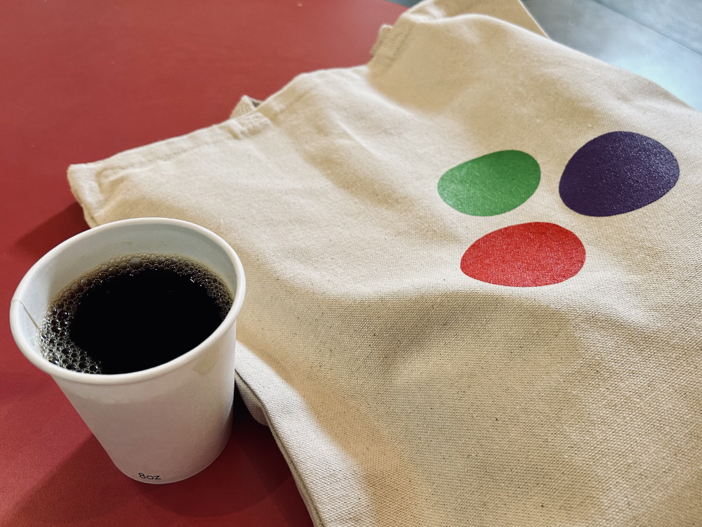

:title JuliaCon 2023
:description Takeaways from attending JuliaCon 2023
:date 2023-08-05

I have been using Julia full time at work for the past year and for a few side projects. So I decided to have a summer family road trip up the east coast to Boston and attend [JuliaCon 2023](https://juliacon.org/2023/) at MIT.

Overall it was a fantastic experience. Delicious food trucks and more fascinating talks that I could attend.[^1]

[^1]: Good thing the talks were livestreamed and the [recordings](https://www.youtube.com/@TheJuliaLanguage/streams) are available.

And now for a brief summary of the lessons I learned.

- Package Extensions. Try depending on the module itself rather than dispatching on value types/symbols.
- [gmsh](https://gmsh.info) looks like fun and is available in Yggdrasil (https://github.com/JuliaBinaryWrappers/gmsh_jll.jl)
- High-dimensional numerical integration
    - Grid-based methods -> curse of dimensionality N ~ (1/epsilon)^d
    - Monte Carlo methods -> Dimension-independent cost N ~ (1/epsilon)^2 (approximate solution)
    - Can use a Vegas Map to boost efficiency with adaptive sampling
- JuMP can be used for optimal control problems - [Space Shuttle Reentry Trajectory Tutorial](https://jump.dev/JuMP.jl/stable/tutorials/nonlinear/space_shuttle_reentry_trajectory/).
- Designing simulators and control algorithms with Julia that then are used for hardware-in-the-loop testing as well as user training is a common pattern. Both Hermeus[^2] and Brazilian National Institute for Space Research (INPE)[^3] follow this pattern.
- Using Julia and GPUCompiler it is possible to emit code (through the proper llvm incantations) that can run on various embedded targets even if they are not officially Julia targets and/or do not have enough resources to actually run Julia itself. This is highly experimental and I look forward to watching it evolve. see [AVRCompiler.jl](https://github.com/Seelengrab/AVRCompiler.jl) and [AVRDevices.jl](https://github.com/Seelengrab/AVRDevices.jl).

[^2]: Supersonic plane design.
[^3]: Attitude and orbit control subsystem for satellites.

I hope that I am able to attend again next year. Maybe even with a talk about [GottaCatchEmAll.jl](https://gottacatchemalljl.com).
