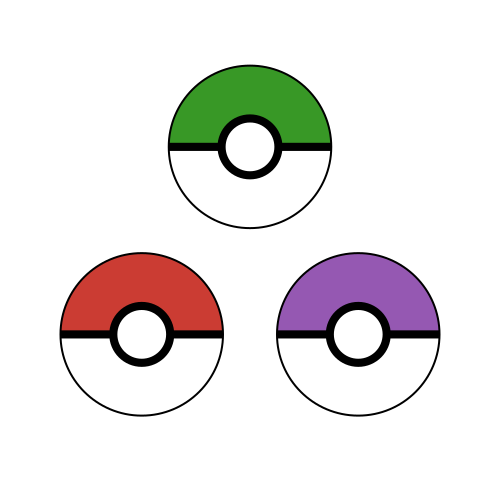
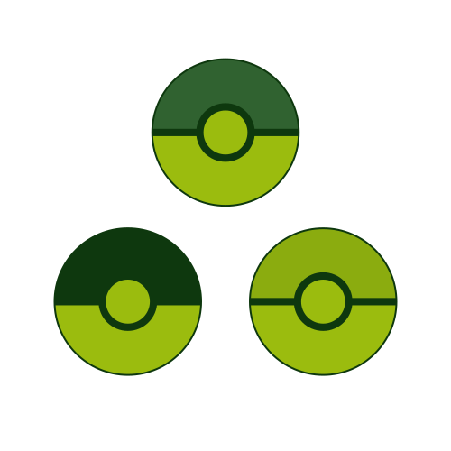
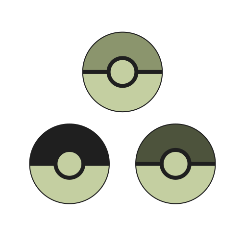

:title Making a Logo with Luxor
:description Designing a logo for my side project with code
:date 2025-02-07
:category Pokémon

[Luxor](https://juliagraphics.github.io/Luxor.jl/stable/) is a package for drawing vector images with code in Julia.

Let's use it to design a logo for [Genone](/writing/genone).
Something inspired by both Julia and Pokémon.

First, we import the package.
And since we want to define colors, we also import a package for that. (Colors is one of Luxor's dependencies anyway. We just need some of the terms exposed.)

```julia
using Luxor, Colors
```

Then we define a struct to represent the color palette and constructor to select the color palette based on theme name.
We have three variants depending on where we are rendering it.

One variant is inspired by the Julia logo.
Another is inspired by the original Game Boy (known as DMG based on the silkscreen of the pcb found in those consoles.)
And the third is inspired by the Game Boy Pocket (because it is my first game boy).

```julia
struct Palette
    sequence
    fill
    border

    function Palette(theme::Symbol)::Palette
        if color_theme == :Julia
            color_sequence = [Luxor.julia_red, Luxor.julia_green, Luxor.julia_purple]
            fill_color = (1, 1, 1, 1)
            border_color = (0, 0, 0, 1)
            Palette([Luxor.julia_red, Luxor.julia_green, Luxor.julia_purple],
                    (1, 1, 1, 1),
                    (0, 0, 0, 1))
        elseif color_theme == :DMG
            Palette([(0.058, 0.219, 0.058, 1.0), (0.188, 0.3843, 0.188, 1.0), (0.545, 0.675, 0.0588, 1.0)],
                    (0.607, 0.737, 0.058, 1),
                    (0.058, 0.219, 0.058, 1.0))
        elseif color_theme == :{ocket
            Palette([(0.1215, 0.1215, 0.1215, 1), (0.545, 0.584, 0.4275, 1), (0.3019, 0.3254, 0.2353, 1)],
                    (0.7686, 0.8117, 0.6313, 1),
                    (0.1215, 0.1215, 0.1215, 1))
        else
            throw("Unknown color theme $(color_theme). Try Julia, DMG, or Pocket.")
        end
    end
end
```

Now that we have the option to switch color palettes, we need to define the paths to draw.
Time for another function.

```julia
function paths(radius::Float64, palettte::Palette)
    origin()                            # Initialize the coordinate system
    outercircleratio = 0.65             # Define the ratio between the outline of the ball and the inner button.
    r = outercircleratio * radius

    points = ngon(O + (0, radius*0.175), radius, 3, pi/6, vertices=true) # Define the three centers of our ball triangle. We will then add a pokeball on each one with the correct color.

    background(RGBA(1, 0, 0, 0))        # Transparent background

    # Let's iterate through the points, drawing a Pokéball at each location
    for (n, p) in enumerate(points)
        # Top/Colored half
        rect(p - (r, r), 2r, r, :clip)
        setcolor(color_sequence[n]...)
        circle(p, r, :path)
        do_action(:fill)
        clipreset()

        # Bottom/White half
        rect(p - (r, 0), 2r, r, :clip)
        setcolor(fill_color)
        circle(p, r, :path)
        do_action(:fill)
        clipreset()

        # Middle stripe and circle
        setcolor(border_color)
        circle(p, 0.4 * r, :path)
        rect(p - (r, .05r), 2r, .1r, :path)
        do_action(:fill)

        # Button
        setcolor(fill_color)
        circle(p, 0.3 * r, :path)
        do_action(:fill)

        # Border
        setcolor(border_color)
        circle(p, r, :path)
        do_action(:stroke)

        # Next ball
        newsubpath()
    end

    points
end
```


And then finally we can tell Luxor which filetype and location on disk to save our image.

```julia
# Render a 500x500 svg to "logo.svg" with the Julia theme.
@svg logopaths(125, Palette(:Julia)) 500 500 "logo.svg"
```

The overall mindsest is to 

1. define your canvas
2. layout the positioniing of your items on the canvas
3. draw each item on the canvas.

Here are the final images we produced for each color scheme.




