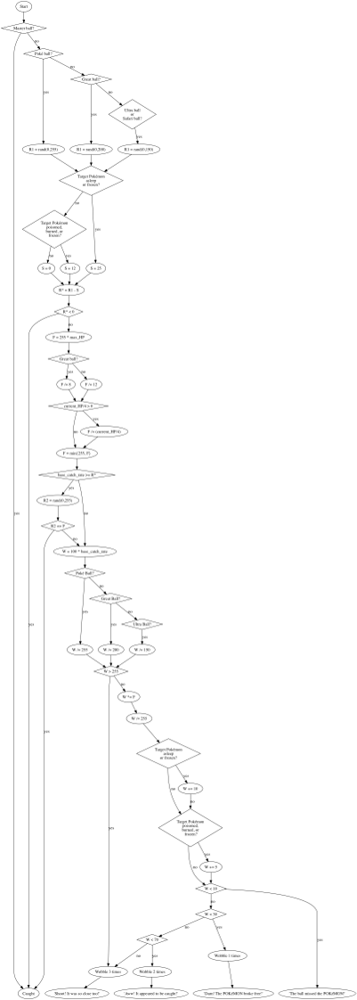

:title Pokemon Capture Mechanics
:description Flow chart describing the capture algorithm for Pokémon Blue, Red, and Yellow.
:date 2014-05-13
:slug pokemon-capture-mechanics
:category Pokémon

Last year on her <a href="http://www.dragonflycave.com">website</a>, Hlín published an <a href="http://www.dragonflycave.com/rbycapture.aspx">article</a> exploring the algorithm behind capturing Pokemon in the <a href="http://bulbapedia.bulbagarden.net/wiki/Generation_I">first generation</a> of games. Later games have a vastly different capture algorithm based on a straightforward formula. This version is much more complex. So much so, that I had to create a flow chart to understand the process. This post is the result of my work.

Here are the files:
<a href="pokemon-capture-algorithm-flow-chart.dot">dot</a>
<a href="pokemon-capture-algorithm-flow-chart.png">png</a>
<a href="pokemon-capture-algorithm-flow-chart.svg">svg</a>

