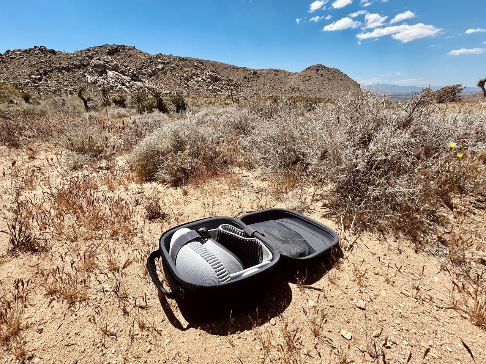

:title Professional Vision
:description Adventures in Being a Professional with my Vision
:date 2024-05-10
:slug professional-vision
:category Apple

I opted to purchase an Apple Vision Pro earlier this year.
I wanted to use it as an external monitor for my laptop when I am away from my desk.
Either around the house or when I travel.

This has worked better than expected.
Even when at my desk I find myself gravitating to Vision Pro over my monitors for the ergonomic benefits.
The height of my desk is no longer a compromise between the monitor and the keyboard.
Particularly when switching from sitting to standing.

# Initial goals and motivation

1. Replace monitor for a minimum of 2 hours without fatigue or eye strain
2. Be flexible about working location (can prioritize ergonomics or noise control without entirely blocking out the family from the basement)
3. Reduce the cognitive overhead of getting in to the zone working on something.

# Remote Access
There are many devices I want to be able to access from the headset and there are many ways to do that.

Here are the ways I have tried so far.

## Mac Virtual Display.
If your laptop is nearby and open (not clamshell mode) it works as expected.
Perfect accessory.
However, that is only one of the devices I need to connect to. And by default I have my laptop in clamshell mode when I'm at home.

## La Terminal
Using La Terminal I can run a full blown ssh client to any of my computers or remote servers.
Great option for connecting to linux servers.

## Screens
I have been using screens to connect to computers from my iPad for a few years.
Version 5.2 just came out and includes a native Vision Pro application.

Nothing else to say.
Works as advertised.
Staying in my toolkit.

## Xbox
I also tested the remote play feature in the Xbox application.
It is the iPad application and works as expected (with all of the caveats that come with running an app in compatibility mode).
Connecting a spare xbox controller to the headset also worked flawlessly.

The only downside of this approach is that the stream is limited to 720p with occasional artifacting.
Workable for playing turn based games but the lack of fidelity took away some of the appeal of playing Bauldr's Gate.

## Moonlight
How can I stream my gaming pc? To be tested still.

# Getting things done

Working copy

Runestone

These two tools are how I wrote this entire post.

# It's Roadtrip
Used on [road trip](/writing/road-trip).

- Giant monitor is a huge win. Even over the 16” MacBook Pro. The ergonomics are also a great win. I only need to find/construct a surface that is the right height for my wrists/keyboard. No longer a compromise between neck and wrists! (This in and of itself is worth the price of admission to me.)
- In passenger seat (phone hotspot)
- In hotels (worked great even with bizarre captive portals/etc. super glad VPN support is built in. gave me confidence to experiment.)
- At Joshua Tree. My favorite spatial environment.

Watched [Spider-Man: Into the Spiderverse](https://en.wikipedia.org/wiki/Spider-Man:_Into_the_Spider-Verse)
- Great movie. Highly recommend in whatever format or device you want.
- Pretty sure that depth of field is the most important cinematography aspect to me. I am not a fan of the 3d movies or spatial video. I want to be in control of what I’m looking at. Not having focus change while the perspective does is disorienting to me. The environments and full 3d apps on the other hand -> A+

My 3yo daughter thinks I have my “robot eyes on”.

# Apps I've tried

## Native
- [Blackbox for Vision](https://apps.apple.com/us/app/blackbox-for-vision/id6458588937)
- [Game Room](https://apps.apple.com/us/app/game-room/id1642897935)
- [La Terminal](https://apps.apple.com/us/app/la-terminal-ssh-client/id1629902861)
- [Lego Builder’s Journey](https://apps.apple.com/us/app/lego-builders-journey/id1441636691)
- [Omnifocus](https://apps.apple.com/us/app/omnifocus-4/id1542143627)
- [Puzzling Places](https://apps.apple.com/us/app/puzzling-places/id6473639841)
- [Runestone](https://apps.apple.com/us/app/runestone-text-editor/id1548193893)
- [Screens](https://apps.apple.com/us/app/screens-5-vnc-remote-desktop/id1663047912)
- [Vroom](https://www.reddit.com/r/VisionPro/comments/1b5ij71/vroom_f1_app_on_apple_vision_is_amazing/)
- [Wisp World](https://apps.apple.com/us/app/wisp-world/id6476198961)

## iPad Compatability
- [Working Copy](https://apps.apple.com/us/app/working-copy-git-client/id896694807)
- [Xbox](https://apps.apple.com/us/app/xbox/id736179781)
- [A Game of Thrones: Board Game](https://apps.apple.com/us/app/a-game-of-thrones-board-game/id1483771411)

Being an iPad first user for the past 8 years has definitely set me up to be successful with VisionOS.
Most of my workflows have translated directly.
But now window management works.

# Nova Spatial Labs
A local [Vision Pro user group](https://www.meetup.com/nova-spatial-labs/).
Surprisingly fun to go and talk with other people about a new technology.

# Train
On the train to New York I used my Vision Pro.

I watched [Fantastic Beasts and Where to Find Them](https://en.wikipedia.org/wiki/Fantastic_Beasts_and_Where_to_Find_Them_(film\)) and [Dune: Part 1](https://en.wikipedia.org/wiki/Dune_(2021_film\)).

I'm not sure what it is about 3D movies.
I get a massive headache and eye strain within 10 minutes.
My only 3D experience prior was with the Nintendo 3DS.
No issues there despite hundreds of hours of Pokémon.
I think it has something to do with the lack of control.
Having to go along with the director's opinion on what things are at what depth doesn't work with my eyes and brain.
Oh well.
Watching the movies in 2D on a giant screen exceeded my expectations.

Travel mode has quite a few limitations that I somehow didn't run in to on the road trip.
Looking out of the window, even partially, would cause tracking to fail.
Turning the interface into a single full screen prompt.
I also got very good at recentering my vision.
The movie would slowly tilt with the motion of the train.

Having power in the seat was convenient.
No issues with battery on a three hour train ride. (I even bought a second battery in anticipation of this trip. Didn't end up needing it.)

# Conclusion
I am thrilled with my purchase.
The ergonomic benefits and flexible working locations are a huge quality of life improvement.
I look forward to seeing what comes at WWDC.
