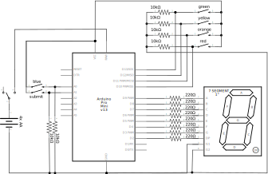
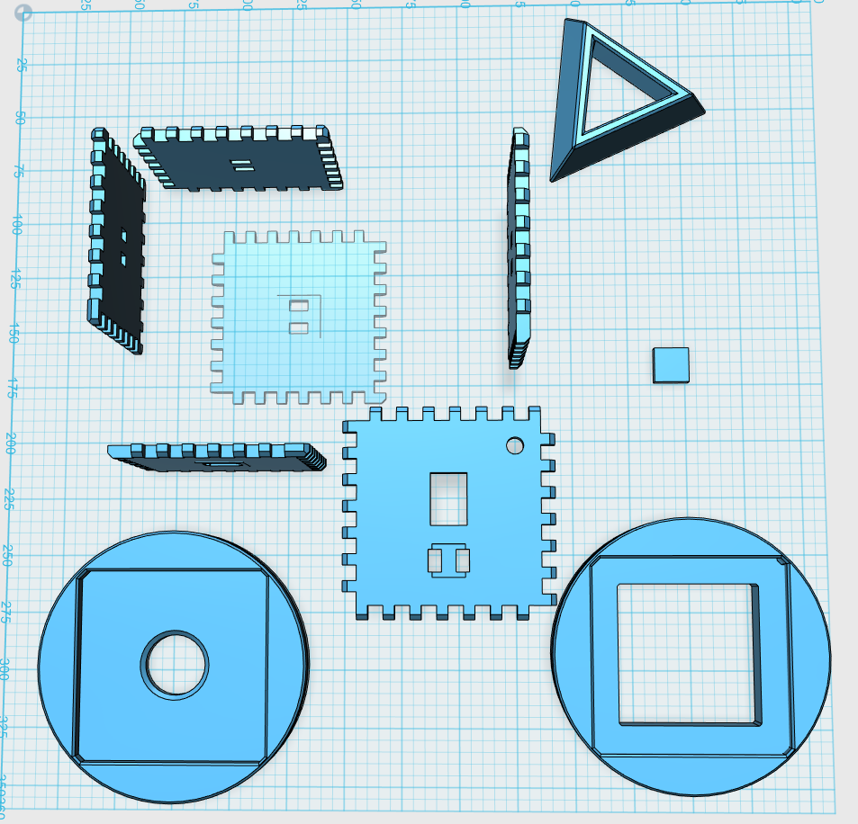

:title Rainbow Box
:description Polychromatic, 3D printed, electronic logic puzzle
:date 2017-01-30
:category Puzzling

<video autoplay="autoplay" loop="loop" width="400" height="300">
  <source src="rainbow_box_intro.mp4" type="video/mp4" />
  
</video>

## Overview of Puzzle
Last weekend I wanted to continue learning about arduino and 3D printing, so I created a physical logic puzzle.
Inspired by the [XBox](http://thefaminegame.com/puzzles/14-XBox.html) [puzzle](https://www.youtube.com/watch?v=o_8e6XgAiow) from the Famine Games, the Rainbow Box is a logic puzzle where the goal is to enter the word "rainbow" into the box.
There is not much else I can say about the puzzle without spoiling it.

  <h1>Spoiler Warning</h1>
  

  
The rest of this post will provide the solution as well as explore the implementation of the puzzle. If you want to solve the puzzle yourself stop here and come back once you are done.

## Solution

  <h1>Note</h1>
  

  
Since the seven segment display has only two columns of vertical lines it is impossible to render the entire alphabet, including "w". Which is necessary for entering the word "rainbow". Thus it is required to determine the function of each button before submitting an answer.  I guess one could brute force it by trying all 32 combinations after entering "rainbo", but that defeats the goal of a puzzle.

To begin, flip the switch and wait for the screen to finish displaying the spiral.
Now the box is ready to receive input.
There are six buttons, one on each side of the cube.
The first step in solving is to observe what each button does when pressed individually.

The blue button displays a `p`.
The green button displays an `h`.
The orange button displays a `b`.
The red button displays an `a`.
The white button displays the phrase `nope`.
The yellow button displays `d`.

The white button is an obvious outlier, displaying a phrase instead of a single letter.
From this fact we deduce that the white button is used to submit the current letter.
Now we have to look at the colored buttons.
The table below sorts the buttons alphabetically based on the letter produced when pressed.

<figure>
  <table>
    <thead><tr><th>Button Color</th><th>Letter Displayed</th></tr></thead>
    <tbody>
      <tr><td>red</td><td><code>a</code></td></tr>
      <tr><td>orange</td><td><code>b</code></td></tr>
      <tr><td>yellow</td><td><code>d</code></td></tr>
      <tr><td>green</td><td><code>h</code></td></tr>
      <tr><td>blue</td><td><code>p</code></td></tr>
    </tbody>
  <table>
  <figcaption>Fig1. Mapping from button to letter</figcaption>
</figure>

Alphabetizing the button characters has revealed an interesting pattern: the buttons are now ordered based on the colors of the rainbow.[^1]
The next step is to try pairs of buttons.
For each pair of buttons predict what be displayed and record the output in a five-by-five table.

<figure>
  <table>
    <thead><tr><th></th><th>red</th><th>orange</th><th>yellow</th><th>green</th><th>blue</th></tr></thead>
    <tbody>
      <tr><th>red</th>   <td>              </td><td><code>c</code></td><td><code>e</code></td><td><code>i</code></td><td><code>q</code></td></tr>
      <tr><th>orange</th><td><code>c</code></td><td>              </td><td><code>f</code></td><td><code>j</code></td><td><code>r</code></td></tr>
      <tr><th>yellow</th><td><code>e</code></td><td><code>f</code></td><td>              </td><td><code>l</code></td><td><code>t</code></td></tr>
      <tr><th>green</th> <td><code>i</code></td><td><code>j</code></td><td><code>l</code></td><td>              </td><td><code>?</code></td></tr>
      <tr><th>blue</th>  <td><code>q</code></td><td><code>r</code></td><td><code>t</code></td><td><code>?</code></td><td>              </td></tr>
    </tbody>
  </table>
  <figcaption>Fig2. Pairs of buttons</figcaption>
</figure>

Now that all of the pairs of buttons have been observed there is enough information to make a hypothesis about the role of each button.
Start by looking at the list of single button outputs: `b`, `d`, `h`, `p`.
Compare that list with the list of pairs which include the red button: `c`, `e`, `i`, and `q`.
Notice that the characters in the red button list are the very next character in the alphabet.
From this, the hypothesis is that the red button shifts the output by one letter.
This hypothesis can be tested by pressing the red button along with one of the non-red pairs.
Pressing the orange, yellow, and red buttons simulataneously reveals a `g`.
Thereby confirming our hypothesis.

Using the same process shows that the orange button (`c`, `f`, `j`, `r`) shifts by two letters and the yellow button(`e`, `f`, `l`, `t`) shifts by four letters.
Green (`i`, `j`, `l`, `?`) and blue (`q`, `r`, `t`, `?`) appear to shift by eight and sixteen but have an unknown letter.
Based on our theory we can resolve that ambiguity by adding the red button and then shifting backwards by one letter.
green-blue-red reveals a `y` which means that green-blue is `x`.

The buttons shift the display character by `1`, `2`, `4`, `8`, or `16`.
All of which are powers of two.
This means that the box is using each button to represent a single bit in the the letter that is displayed.
The following figure shows the conversion between bits and letters.

<figure>
  <table>
    <thead><tr><th>Letter</th><th>Index</th><th>Binary</th></tr></thead>
    <tbody>
      <tr><td>A</td><td> 1</td><td><code>00001</code></td></tr>
      <tr><td>B</td><td> 2</td><td><code>00010</code></td></tr>
      <tr><td>C</td><td> 3</td><td><code>00011</code></td></tr>
      <tr><td>D</td><td> 4</td><td><code>00100</code></td></tr>
      <tr><td>E</td><td> 5</td><td><code>00101</code></td></tr>
      <tr><td>F</td><td> 6</td><td><code>00110</code></td></tr>
      <tr><td>G</td><td> 7</td><td><code>00111</code></td></tr>
      <tr><td>H</td><td> 8</td><td><code>01000</code></td></tr>
      <tr><td>I</td><td> 9</td><td><code>01001</code></td></tr>
      <tr><td>J</td><td>10</td><td><code>01010</code></td></tr>
      <tr><td>K</td><td>11</td><td><code>01011</code></td></tr>
      <tr><td>L</td><td>12</td><td><code>01100</code></td></tr>
      <tr><td>M</td><td>13</td><td><code>01101</code></td></tr>
      <tr><td>N</td><td>14</td><td><code>01110</code></td></tr>
      <tr><td>O</td><td>15</td><td><code>01111</code></td></tr>
      <tr><td>P</td><td>16</td><td><code>10000</code></td></tr>
      <tr><td>Q</td><td>17</td><td><code>10001</code></td></tr>
      <tr><td>R</td><td>18</td><td><code>10010</code></td></tr>
      <tr><td>S</td><td>19</td><td><code>10011</code></td></tr>
      <tr><td>T</td><td>20</td><td><code>10100</code></td></tr>
      <tr><td>U</td><td>21</td><td><code>10101</code></td></tr>
      <tr><td>V</td><td>22</td><td><code>10110</code></td></tr>
      <tr><td>W</td><td>23</td><td><code>10111</code></td></tr>
      <tr><td>X</td><td>24</td><td><code>11000</code></td></tr>
      <tr><td>Y</td><td>25</td><td><code>11001</code></td></tr>
      <tr><td>Z</td><td>26</td><td><code>11010</code></td></tr>
    </tbody>
  </table>
  <figcaption>Fig3. letters, decimal, and binary representations of numbers</figcaption>
</figure>

The table above shows the buttons needed to enter each letter.

<ol style="margin: 0.8em 0; list-style: decimal; list-style-position: inside;">
  <li><code>r</code> = <code>10010</code> = blue + orange</li>
  <li><code>a</code> = <code>00001</code> = red</li>
  <li><code>i</code> = <code>01001</code> = green + red </li>
  <li><code>n</code> = <code>01110</code> = green + yellow + orange</li>
  <li><code>b</code> = <code>00010</code> = orange</li>
  <li><code>o</code> = <code>01111</code> = green + yellow + orange + red</li>
  <li><code>w</code> = <code>10111</code> = blue + yellow + orange + red</li>
</ol>

Entering each of the button combinations above produces the final message: "congrats you have found the pot of gold" which is the end of the puzzle.

## Typeface

Each letter is rendered on the seven segment display.
The rendering process uses the integer computed from the current button configuration as an index into the typeface table.
Each row of the table contains eight integers representing the signal to send to each segment (`HIGH` or `LOW`).

The following figure is a JavaScript implementation of the rendering process.
The text input accepts a single character and displays it on the adjacent display.
Some of the characters are not renderable and are represented by a single dot.

<figure style="text-align: center;">
  

    <input style="display: inline-block; vertical-align: middle; width: 2em; padding: 0.3em; font-size: 3em; text-align: center; cursor: none; margin: 0.3em;" id="typeface-entry" type="text" maxlength="1" />
    <svg style="display: inline-block; vertical-align: middle;" height="100px" viewBox="0 0 13 18">
      <g style="fill-rule:evenodd; stroke:#ffffff; stroke-width:0.25; stroke-opacity:1; stroke-linecap:butt; stroke-linejoin:miter;">
        <polygon id="led-a" points=" 1, 1  2, 0  8, 0  9, 1  8, 2  2, 2" fill="#dddddd" />
        <polygon id="led-b" points=" 9, 1 10, 2 10, 8  9, 9  8, 8  8, 2" fill="#dddddd" />
        <polygon id="led-c" points=" 9, 9 10,10 10,16  9,17  8,16  8,10" fill="#dddddd" />
        <polygon id="led-d" points=" 9,17  8,18  2,18  1,17  2,16  8,16" fill="#dddddd" />
        <polygon id="led-e" points=" 1,17  0,16  0,10  1, 9  2,10  2,16" fill="#dddddd" />
        <polygon id="led-f" points=" 1, 9  0, 8  0, 2  1, 1  2, 2  2, 8" fill="#dddddd" />
        <polygon id="led-g" points=" 1, 9  2, 8  8, 8  9, 9  8,10  2,10" fill="#dddddd" />
        <circle id="led-h" cx="11" cy="17" r="1"  fill="#dddddd"/>
      </g>
    </svg>
  

  <figcaption>Fig4. Typeface Explorer</figcaption>
</figure>

## Code

The code centers around one main data strucure, `state`.
`state` represents the current state of each button (pressed or not) and the current stage of the puzzle (which letters have been correctly entered).
There are then a series of functions which construct the state from the buttons, render the state on the display, and submit a letter.
The `numberEntered` function is particularly interesting as it succintly summarizes the entire puzzle.

    const int LED_A = 2;
    const int LED_B = 3;
    const int LED_C = 4;
    const int LED_D = 5;
    const int LED_E = 6;
    const int LED_F = 7;
    const int LED_G = 8;
    const int LED_H = 9;
    const int RED_PIN = 10;
    const int ORANGE_PIN = 11;
    const int YELLOW_PIN = 12;
    const int GREEN_PIN = 13;
    const int BLUE_PIN = 14;
    const int SUBMIT_PIN = 15;

    static const int typeface[32][8] =
      { {LOW,  LOW,  LOW,  LOW,  LOW,  LOW,  LOW,  LOW }
      , {HIGH, HIGH, HIGH, LOW,  HIGH, HIGH, HIGH, LOW }
      , {LOW,  LOW,  HIGH, HIGH, HIGH, HIGH, HIGH, LOW }
      , {HIGH, LOW,  LOW,  HIGH, HIGH, HIGH, LOW,  LOW }
      , {LOW,  HIGH, HIGH, HIGH, HIGH, LOW,  HIGH, LOW }
      , {HIGH, LOW,  LOW,  HIGH, HIGH, HIGH, HIGH, LOW }
      , {HIGH, LOW,  LOW,  LOW,  HIGH, HIGH, HIGH, LOW }
      , {HIGH, HIGH, HIGH, HIGH, LOW,  HIGH, HIGH, LOW }
      , {LOW,  LOW,  HIGH, LOW,  HIGH, HIGH, HIGH, LOW }
      , {LOW,  LOW,  LOW,  LOW,  HIGH, HIGH, LOW,  LOW }
      , {LOW,  HIGH, HIGH, HIGH, HIGH, LOW,  LOW,  LOW }
      , {LOW,  HIGH, HIGH, LOW,  HIGH, HIGH, HIGH, HIGH}
      , {LOW,  LOW,  LOW,  HIGH, HIGH, HIGH, LOW,  LOW }
      , {LOW,  LOW,  LOW,  LOW,  LOW,  LOW,  LOW,  HIGH}
      , {LOW,  LOW,  HIGH, LOW,  HIGH, LOW,  HIGH, LOW }
      , {HIGH, HIGH, HIGH, HIGH, HIGH, HIGH, LOW,  LOW }
      , {HIGH, HIGH, LOW,  LOW,  HIGH, HIGH, HIGH, LOW }
      , {HIGH, HIGH, HIGH, LOW,  LOW,  HIGH, HIGH, LOW }
      , {LOW,  LOW,  LOW,  LOW,  HIGH, LOW,  HIGH, LOW }
      , {HIGH, LOW,  HIGH, HIGH, LOW,  HIGH, HIGH, LOW }
      , {LOW,  LOW,  LOW,  HIGH, HIGH, HIGH, HIGH, LOW }
      , {LOW,  LOW,  HIGH, HIGH, HIGH, LOW,  LOW,  LOW }
      , {LOW,  HIGH, HIGH, HIGH, HIGH, HIGH, LOW,  LOW }
      , {LOW,  LOW,  LOW,  LOW,  LOW,  LOW,  LOW,  HIGH}
      , {LOW,  LOW,  LOW,  LOW,  LOW,  LOW,  LOW,  HIGH}
      , {LOW,  HIGH, HIGH, HIGH, LOW,  HIGH, HIGH, LOW }
      , {HIGH, HIGH, LOW,  HIGH, HIGH, LOW,  HIGH, LOW }
      , {LOW,  LOW,  LOW,  LOW,  LOW,  LOW,  LOW,  LOW }
      , {LOW,  LOW,  LOW,  LOW,  LOW,  LOW,  LOW,  LOW }
      , {LOW,  LOW,  LOW,  LOW,  LOW,  LOW,  LOW,  LOW }
      , {LOW,  LOW,  LOW,  LOW,  LOW,  LOW,  LOW,  LOW }
      , {LOW,  LOW,  LOW,  LOW,  LOW,  LOW,  LOW,  LOW } };

    void setup() {
      pinMode(LED_A, OUTPUT);
      pinMode(LED_B, OUTPUT);
      pinMode(LED_C, OUTPUT);
      pinMode(LED_D, OUTPUT);
      pinMode(LED_E, OUTPUT);
      pinMode(LED_F, OUTPUT);
      pinMode(LED_G, OUTPUT);
      pinMode(LED_H, OUTPUT);
      pinMode(RED_PIN,    INPUT);
      pinMode(ORANGE_PIN, INPUT);
      pinMode(YELLOW_PIN, INPUT);
      pinMode(GREEN_PIN,  INPUT);
      pinMode(BLUE_PIN,   INPUT);
      pinMode(SUBMIT_PIN, INPUT);

      spiral();
    }

    enum stage {
      START,
      FAIL,
      R,
      RA,
      RAI,
      RAIN,
      RAINB,
      RAINBO,
      WIN,
    };

    struct state {
      enum stage progress;
      bool redPressed;
      bool orangePressed;
      bool yellowPressed;
      bool greenPressed;
      bool bluePressed;
      bool submitPressed;
    };

    void loop() {
      static struct state s = {START, false, false, false, false, false, false};
      readButtons(&s);
      renderState(&s);
      if(s.submitPressed) { submit(&s); }
    }

    void spiral() {
      spiralOn();
      spiralOff();
    }

    void spiralOn() {
      digitalWrite(LED_A, HIGH);
      delay(100);
      digitalWrite(LED_B, HIGH);
      delay(100);
      digitalWrite(LED_C, HIGH);
      delay(100);
      digitalWrite(LED_D, HIGH);
      delay(100);
      digitalWrite(LED_E, HIGH);
      delay(100);
      digitalWrite(LED_F, HIGH);
      delay(100);
    }

    void spiralOff() {
      digitalWrite(LED_A, LOW);
      delay(100);
      digitalWrite(LED_B, LOW);
      delay(100);
      digitalWrite(LED_C, LOW);
      delay(100);
      digitalWrite(LED_D, LOW);
      delay(100);
      digitalWrite(LED_E, LOW);
      delay(100);
      digitalWrite(LED_F, LOW);
      delay(100);
    }

    void readButtons(struct state* s) {
      if (digitalRead(RED_PIN) == HIGH) { s->redPressed = true; } else { s->redPressed = false; }
      if (digitalRead(ORANGE_PIN) == HIGH) { s->orangePressed = true; } else { s->orangePressed = false; }
      if (digitalRead(YELLOW_PIN) == HIGH) { s->yellowPressed = true; } else { s->yellowPressed = false; }
      if (digitalRead(GREEN_PIN) == HIGH) { s->greenPressed = true; } else { s->greenPressed = false; }
      if (digitalRead(BLUE_PIN) == HIGH) { s->bluePressed = true; } else { s->bluePressed = false; }
      if (digitalRead(SUBMIT_PIN) == HIGH) { s->submitPressed = true; } else { s->submitPressed = false; }
    }

    void renderIndex(unsigned int index) {
      if(index > 31) { index = 0; }
      const int* pattern = *(typeface+index);
      digitalWrite(LED_A, *pattern++);
      digitalWrite(LED_B, *pattern++);
      digitalWrite(LED_C, *pattern++);
      digitalWrite(LED_D, *pattern++);
      digitalWrite(LED_E, *pattern++);
      digitalWrite(LED_F, *pattern++);
      digitalWrite(LED_G, *pattern++);
      digitalWrite(LED_H, *pattern++);
    }

    void renderCharacter(char c) {
      if(c >= 'A' && c <= 'Z') {
        renderIndex(c - 'A' + 1);
      } else if(c >= 'a' && c <= 'z') {
        renderIndex(c - 'a' + 1);
      } else {
        renderIndex(0);
      }
    }

    void renderString(char* s) {
      while (*s) {
        renderCharacter(*s++);
        delay(400);
      }
    }

    void renderState(const struct state* s) {
      renderIndex(numberEntered(s));
    }

    void submit(struct state* s) {
      switch(s->progress) {
        case START:
          if(letterEntered(s) == 'R') { s->progress = R; renderString((char*) "r"); } else { s->progress = FAIL; }
          break;
        case R:
          if(letterEntered(s) == 'A') { s->progress = RA; renderString((char*) "a"); } else { s->progress = FAIL; }
          break;
        case RA:
          if(letterEntered(s) == 'I') { s->progress = RAI; renderString((char*) "i"); } else { s->progress = FAIL; }
          break;
        case RAI:
          if(letterEntered(s) == 'N') { s->progress = RAIN; renderString((char*) "n"); } else { s->progress = FAIL; }
          break;
        case RAIN:
          if(letterEntered(s) == 'B') { s->progress = RAINB; renderString((char*) "b"); } else { s->progress = FAIL; }
          break;
        case RAINB:
          if(letterEntered(s) == 'O') { s->progress = RAINBO; renderString((char*) "o"); } else { s->progress = FAIL; }
          break;
        case RAINBO:
          if(letterEntered(s) == 'W') {
            s->progress = WIN;
            renderString((char*) "congrats you have found the pot of gold");
          } else {
            s->progress = FAIL;
          }
          break;
        default:
          break;
      }

      if(s->progress == FAIL) {
        renderString((char*) "nope");
        s->progress = START;
      }
    }

    unsigned int numberEntered(const struct state* s) {
      return (s->redPressed    << 0)
           | (s->orangePressed << 1)
           | (s->yellowPressed << 2)
           | (s->greenPressed  << 3)
           | (s->bluePressed   << 4);
    }

    char letterEntered(const struct state* s) {
      return numberEntered(s) + 'A' - 1;
    }

## Circuit Diagram[^2]

<figure>
  
  <figcaption>Fig5. Circuit Diagram</figcaption>
</figure>

## 3D Models

I created the panels for the box with 123D design.
I started by measuring the battery holder since it is the largest component.
Then I added some buffer and ended up with each panel being 70mm x 70mm x 5mm.
Next I worked out the joints. This was accomplished by adding 5mm x 5mm x 5mm cubes along each edge of each panel, forming a complete 80mm x 80mm x 80mm box.
With all of the pieces in place I started merging the cubes along each edge to one of the two adjacent panels, alternating between each panel to form a finger joint.
When I reached the corners I arbitrarily chose one of the three panels to join the final 8 cubes to.

With the box completed I measured each of the physical components (switches and display).
Then I placed corresponding holes around the box where I wanted the components to be attached.
After the model was finished it was just a matter of printing.

<figure>
  
  <figcaption>Fig6. Screenshot of box parts in 123D Design </figcaption>
</figure>

The model file shown in Fig6 can be [downloaded here](rainbow_box.123dx).

## Assembly

Physically assembling the box was the most challenging aspect of this project.
While I have spent many years learning how to think in three dimensions and how to model the world in software, I have spent zero time soldering outside of assembling my ergodox[^3].
A few burnt fingers and ugly solder joints later I managed to build a working prototype.

Once completing the box I realized that I spent zero time considering the mechanical properties of the wires and solder joints.
This oversight makes the box fragile and replacing the batteries almost always requires pulling out the soldering iron and reattaching wires.
I have already purchased screw terminals, zipties, and a hot glue gun to avoid the same error when building the next puzzle.

## Transportation

In order to store and transport the cube I took the assembled puzzle to the container store and tried fitting it into a bunch of different boxes.
I ended up using one of the cylindrical gift boxes.
Then I created spacers for the top and bottom to prevent the puzzle from bouncing around.
I also attached some foam (left over from one of my pelican cases) to the top spacer to reduce damage from any impacts or vibrations.

[^1]: This ordering mechanic was intentionally created to reduce the amount of memorization required for entering letters.
[^2]: Created with [Fritzing](http://fritzing.org/home/) which was surprisingly intuitive. Highly recommended. NixOS even has a package for it.
[^3]: Speaking of mechanical keyboards, I should really get around to writing that post.
