:title Road Trip
:description Cross country adventure with my family.
:date 2024-05-04
:category Life

We spent 18 days driving across the country and back.
6,759.8 miles through 23 states.
No particular destination in mind.
Just following the road wherever it takes us and spending quality time as a family.

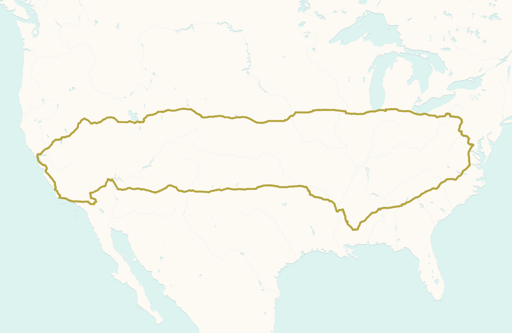

On this trip we decided to keep track of all of the license plates we saw.
We ended up finding all of the continental states, D.C., and U.S. government official use.
The last state we found was West Virginia twenty minutes from home.
Nuevo León and Chihuahua Mexico.
Cherokee, Chocktaw, and Kiowa Nations.
Ontario, Alberta, British Columbia, and Manitoba Canada.
Sixty different license plates overall.

This year Ty re-released some of the original Beanie Babies.
Except this time, with different colors.
Just like a shiny Pokémon hunt.
As we found them they became our driving companions tucked into various corners of the car.
We ended up finding eleven different ones on our trip.
Of course my daughter immediately claimed all of the cats.

Driving through the south eastern states we noticed that each state seemed to have a different color flower.
North Carolina, orange. South Carolina, red. Alabama, yellow. Mississippi, purple.

Enjoying a ride on a swing at the Cherry Blossom festival on our way out of town.
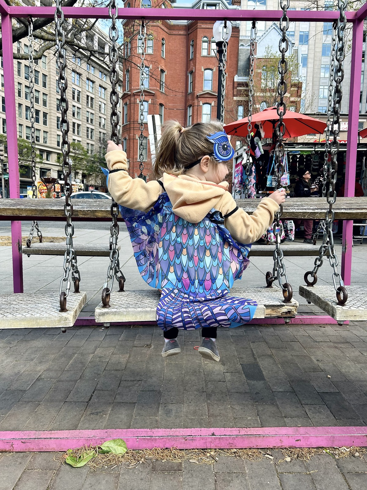

Silly pose with my camera outside the best fried chicken place in Atlanta.
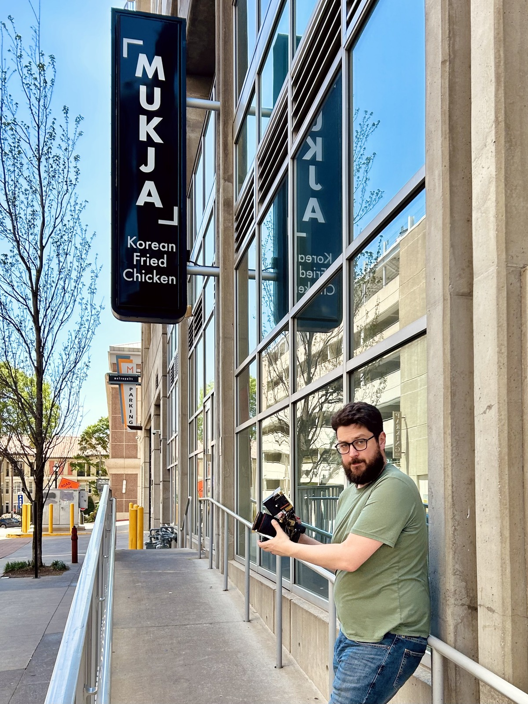

Internet meme gas station somewhere in Alabama.
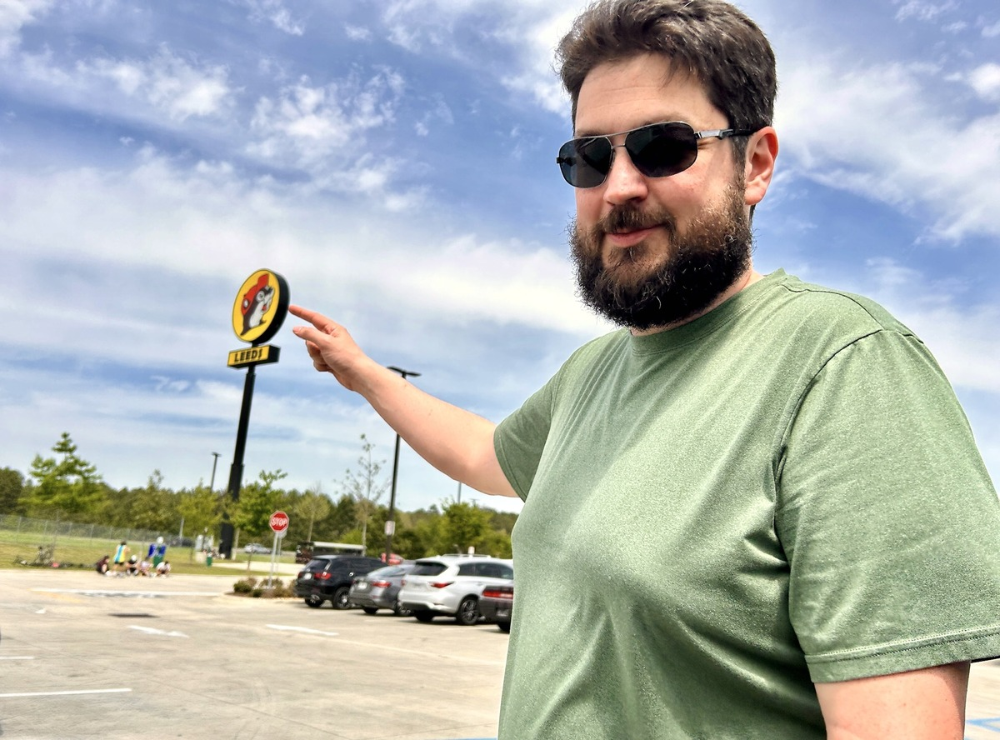

Smelly store we saw on TV once.
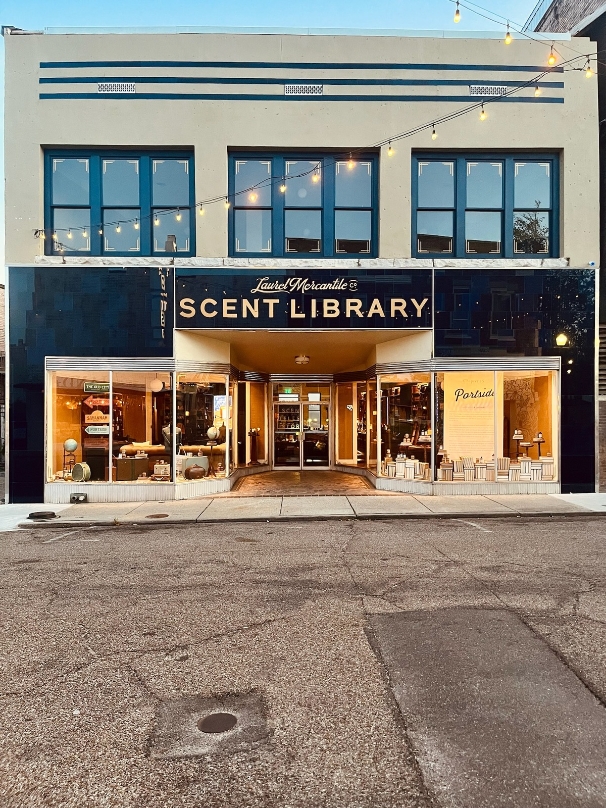

Tacos near our hotel in Oklahoma City.
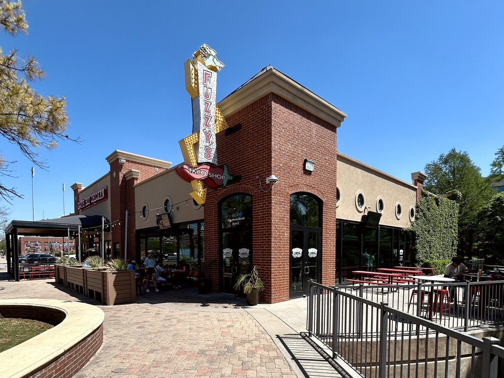

Barbeque with red and green chili peppers.
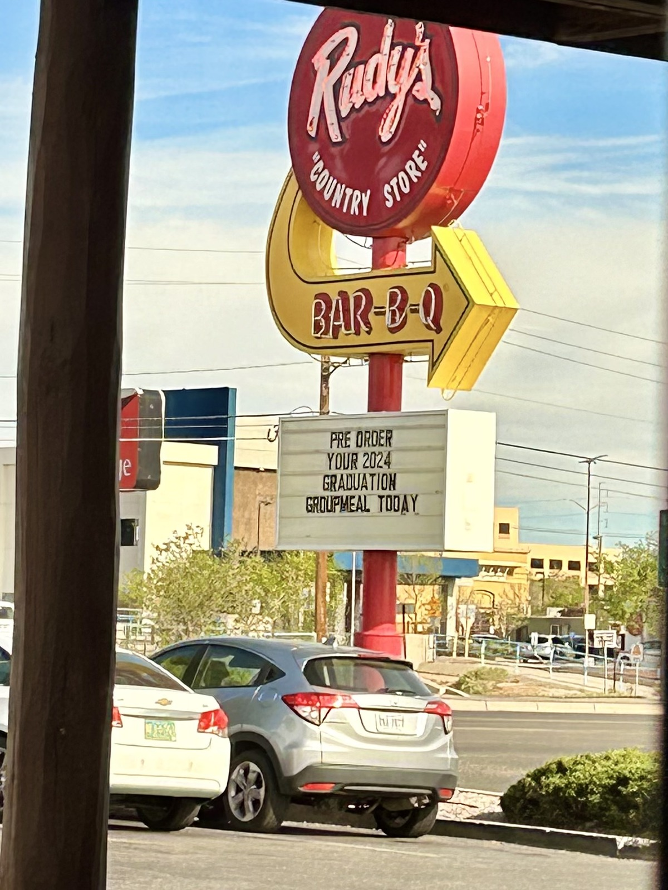

Elevator at Planet Hollywood having as much fun in Vegas as I did.
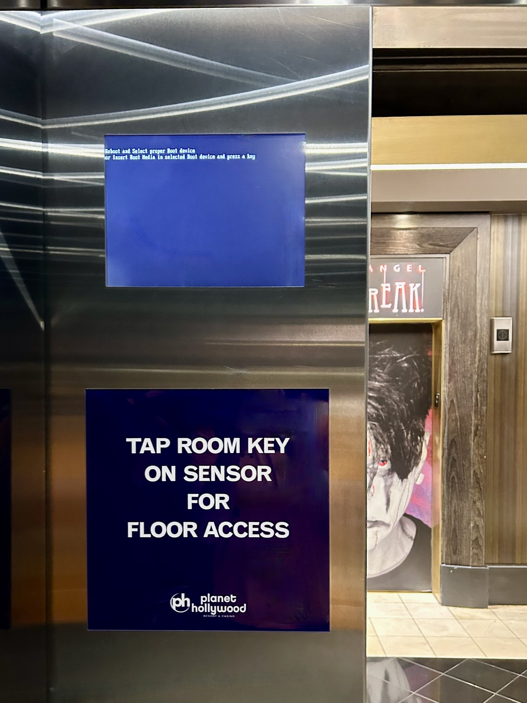

Testing out my [new computer](/writing/professional-vision/) in its native habitat.
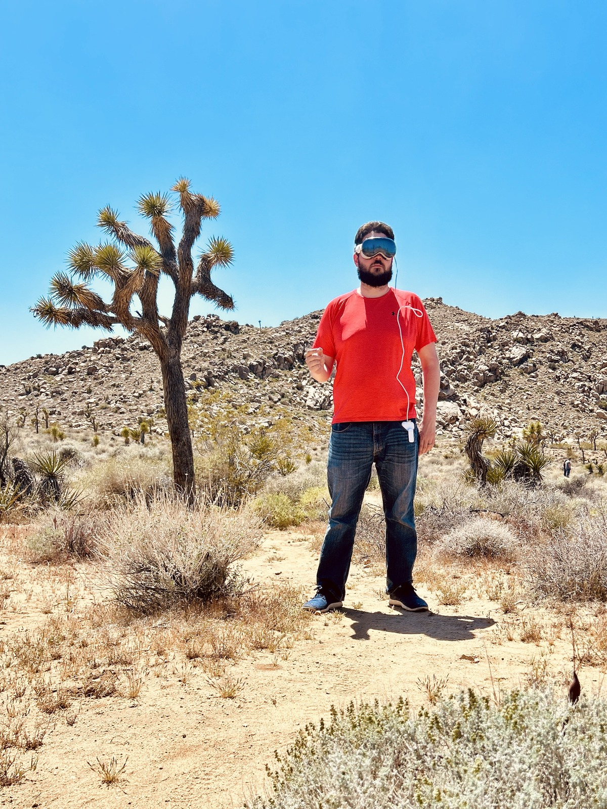

A bridge we heard about.
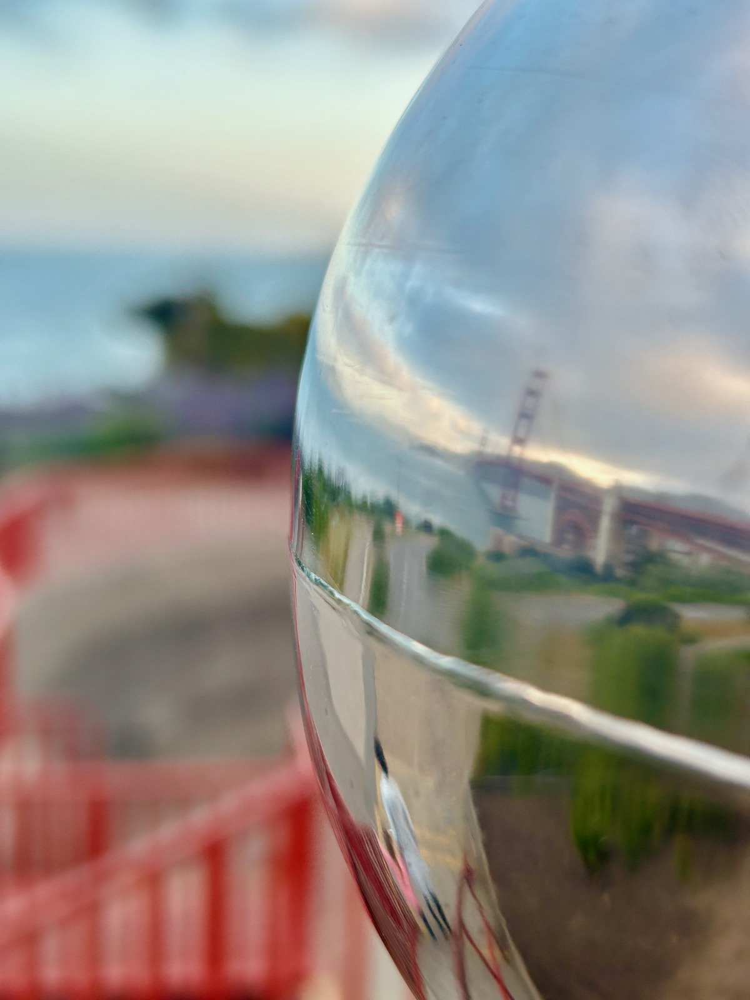

Visiting a pizza shop mentioned on [Upgrade 459](https://www.relay.fm/upgrade/459).

Revisiting a place we used to play board games in grad school.
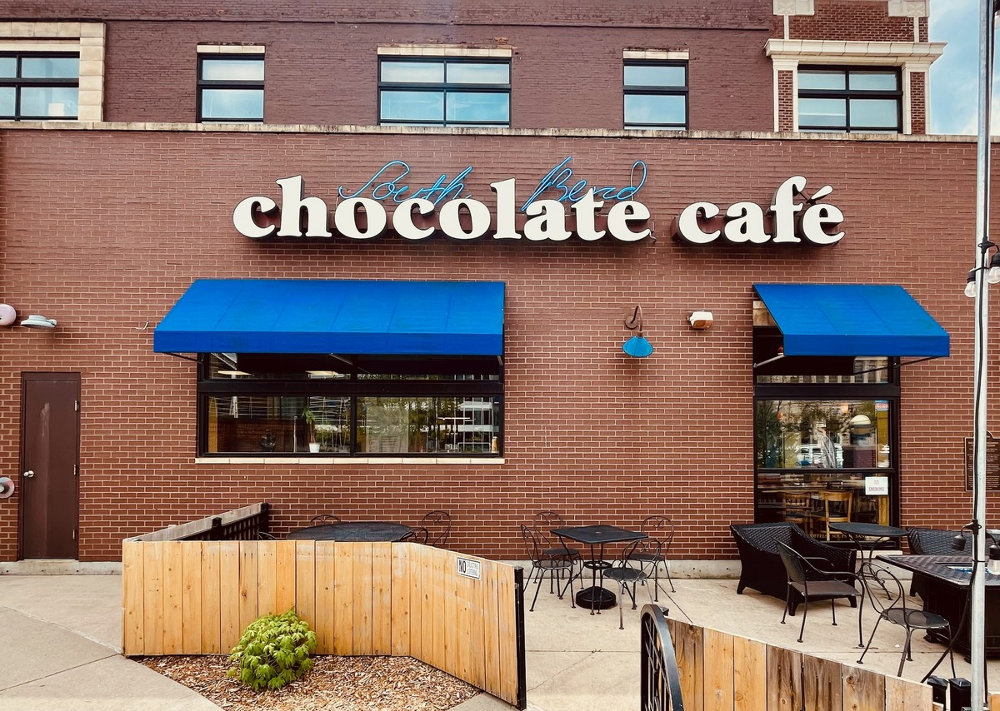
