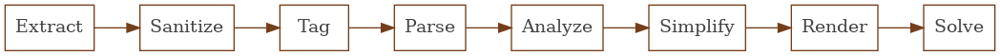
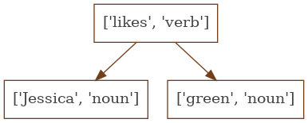

:title Solving Zebra Puzzles with MiniZinc
:tags [puzzles, minizinc]
:description Using integer programming and nlp to solve logic puzzles
:date 2020-12-05

For the past month my wife and I have been solving [Brainzilla's zebra puzzles](https://www.brainzilla.com/logic/zebra) in the evenings while we wait for dinner to cook.
I wanted to see if I could write a program to solve the puzzles.
I [did](zebra.tar.gz).
Well, for at least two of the puzzles and built a framework to expand on for the other puzzles when I want to invest more time.

The core structure of my solution is a single pipeline composed of a series of phases passing their output as input to the next phase, essentially the same structure as a compiler.
Each phase has a separate area of responsibility.

The extract phase reads the PDF version of the puzzle finding the categories and clues.
The [pdf-extraction](https://www.npmjs.com/package/pdf-extraction) package produces a plain text version of the pdf which is sliced into the sections of a puzzle.

The sanitize phase filters out typos, replaces contractions, and normalizes the capitalization of words.
This phase is also a convenient place to inject shortcuts while refining the rest of the pipeline.
For example the clue, _The first person on the right likes Swimming_, includes a compound noun phrase, _the first person_, where the only important word for solving is _first_.
Extracting this meaning would require additional parsing and analysis rules.
If the clue were replaced with _The first on the right likes Swimming_, we can reuse the rules for parsing 'the first' and test the rest of the pipeline.
While a generic solver would minimize the number of these shortcuts, the flexibility can reduce frustration while developing the later stages of the pipeline by removing the more difficult clues until you are ready to work through the additional rules.

The tag phase tokenizes the sentence into words and labels each word with the corresponding part of speech.
The sentence is split into individual words based on whitespace and punctuation.
Each word is then labeled with a preliminary part of speech by searching through an English language lexicon[^1].
A set of grammar heuristics are then applied to the preliminary tags to produce a final part of speech tag.
For example, 'convert a noun to a number if a period appears within the word' or 'convert any word into an adverb if it ends in ly'.
The [pos](https://www.npmjs.com/package/pos) package implements this phase of the pipeline.

The tag phase produces an array of labeled tokens which provides meaning to the individual words.
In order to extract meaning from the entire sentence these tokens are assembled into a tree.
Each node in the tree is one of the labeled tokens.
The root of a tree is the start of a phrase, often a verb or preposition, while the children provide additional context.
Suppose we are parsing the phrase _Jessica likes green_, this phrase would have three tagged tokens (`['Jessica', 'noun'], ['likes', 'verb'], ['green, 'noun']`).
This phrase is an example of a common pattern in english - noun phrase, verb, verb phrase - which produces a dependency tree of `[verb, [noun phrase], [verb phrase]]`.
Or for this specific case

The parse phrase is responsible for producing these dependency trees and is implemented as a collection of rules which encode the common patterns found in the clues.

The dependency tree represents the grammatic structure of the sentence but lacks the semantic meaning required to produce concrete logical constraints.
The analyze phase injects the semantic meaning by walking the dependency tree looking for common patterns (e.g. a `[verb, [noun_a], [noun_b]]` means `noun_a` is `noun_b` or as an s-expression `[is, noun_a, noun_b]`).
This phase also looks for key words from the domain of zebra puzzle clues: positional (e.g. `left`, `right`, `middle`), ordinal words (e.g. `first`, `fourth`, `last`), and relational words (e.g. `next to`, `between`).
If any of these key words are found, the constraints are enhanced with the specific meaning.
For example, if `middle` is found it is replaced with the concrete value `3` or if `between` is found the `is` constraint is replaced with `between`.
Since this phrase is responsible for translating between English and the constraint domain model it is where the most creativity lies and also the most complication.

The analyze phase is constructed to filter and identify constraints.
Its output correctly represents the constraint expressed in the clue, but is often cryptic and verbose.
For example, the analyzed tree for _The girl who likes Skiing sits next to the girl who plays ten-pin bowling_ is the following tree.

    [
      'is',
      [ 'is', undefined, 'Skiing' ],
      [ 'next to',
        [ 'is'
        , undefined
        , 'ten-pin bowling'
        ]
      ],
    ]

The simplify phase is responsible for translating the analyzed trees into single constraints.
The primary tactics of the simplify phase are term rewriting and null removal.
Simplify will walk the tree identifying nulls or common patterns and rewrite that subtree as a simpler expression.
For example, `['is', null, 'Purple']` would be simplified to `'Purple'` and the tree above recursively simplifies to `['next to', 'Skiing', 'ten-pin bowling']`.

The render phase converts the extracted categories and simplified constraints into a model that can be solved by `minizinc`[^2].
This is implemented as straightforward string templates.
Here is an [example](fancy_hotels.mzn) of a puzzle rendered for minizinc to solve.

The solve phase uses the [child_process](https://nodejs.org/api/child_process.html) module to fork/exec `minizinc`, provide the rendered input via a pipe, and parse the output.
Nothing clever here, just plumbing.

That's the whole pipeline.
There are three areas I plan to improve in the future.
The most obvious area is adding more rules to the dependency parser and analyzer to handle a wider variety of clues including: parsing dollar amounts and analyzing "between" relationships.
The second area is using the puzzle categories to expand the tagging lexicon with words that are known to be important in the clues and then incorporating the categories into the analyzer to make more accurate decisions about compound nouns.
The last area is introducing a knowledge base to properly analyze the trivia portions of some of the clues (e.g. _At the third position is the hotel founded when The Great Depression started_).

This was a fun project to learn more about natural language processing and constraint solving.
I wonder what other puzzles I can solve with MiniZinc.

[^1]: essentially a dictionary of common words and their part of speech
[^2]: What is MiniZinc? The [MiniZinc website](https://www.minizinc.org/) and [Hillel Wayne](https://www.hillelwayne.com/post/minizinc/) answer this much better than I can.
