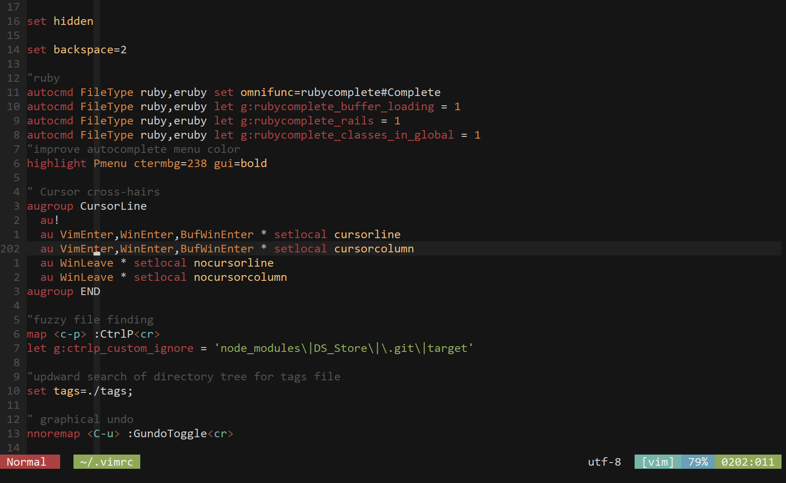

:title Vim Navigation Visual Aids
:description Two configurations I rely on in vim to reduce cognitive load when navigating in vim.
:date 2019-11-06
:category Unix Utilities

Navigating through a document in a text editor like vim is often a two dimensional operation based on rows and columns.
I added a configuration to my vimrc which guides my eyes directly towards the cursor in the current window: cursor crosshairs.
This setting highlights the column and row that the cursor currently occupies.
Now finding the cursor is just a matter of visually tracing the two lines on my screen instead of a visual scan through a document.

    " Cursor cross-hairs
    augroup CursorLine
      au!
      au VimEnter,WinEnter,BufWinEnter * setlocal cursorline
      au VimEnter,WinEnter,BufWinEnter * setlocal cursorcolumn
      au WinLeave * setlocal nocursorline
      au WinLeave * setlocal nocursorcolumn
    augroup END

Now that it is trivial to find the cursor it is time to invest in reducing the friction of finding the target of a move.
Nearly every move I want to do in vim is relative; go 5 lines up or 18 lines down.
So why not have the line numbers be shown as relative to the current cursor position?

  set relativenumber number

And for those times where you need an absolute line number (often the output from a compiler) you can always use `gg` to jump straight to the line.

