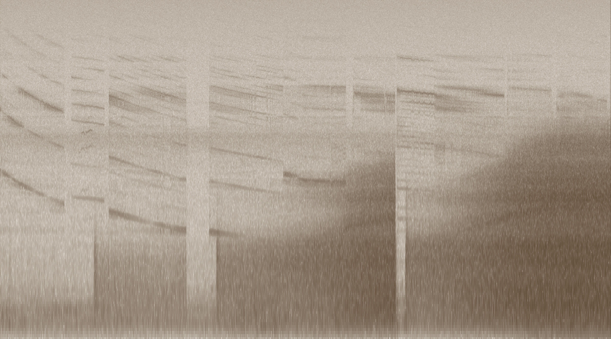

:title What Does the LLM Say?
:description Cheep-chirp-chirp-chirp-chirpcheepchrip!
:date 2025-09-09
:category Computer Science





<audio controls src="what-does-the-llm-say.mp3" type="audio/mpeg"></audio>

Recording the coil whine on my laptop as I generate haikus with various models.

```
echo "qwen3-coder"
say "Qwen 3 Coder"
ollama run qwen3-coder:latest "Generate 100 haikus"
sleep 30

echo "mistral-7b"
say "Mistral 7b Instruct"
ollama run mistral:7b-instruct-v0.3-q8_0 "Generate 100 haikus"
sleep 30

echo "qwen3:8b"
say "Qwen 3 8b"
ollama run qwen3:8b "Generate 100 haikus"
sleep 30

echo "gemma3:4b"
say "Gemma 3 4b"
ollama run gemma3:4b "Generate 100 haikus"
sleep 30

echo "qwen3:32b"
say "Qwen 3 32b"
ollama run qwen3:32b "Generate 10 haikus"
sleep 30

echo "gemma3:27b"
say "Gemma 3 27B"
ollama run gemma3:27b "Generate 10 haikus"
sleep 30

echo "deepseek-r1"
say "Deepseek R1"
ollama run deepseek-r1:latest "Generate 10 haikus"
sleep 30

```